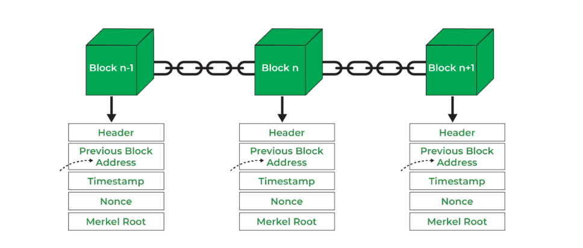

区块链网络记录着大量的交易活动。保留这些交易记录有助于系统跟踪使用或未使用的数量以及涉及的各方。在给定的时间段内进行的交易被记录在一个称为区块的文件中，这是区块链网络的基础。

区块链中最基本的单位是一个区块。从字面上理解，区块链是由相互连接的区块组成的链条。那么构成这个链条的区块是什么？可以从区块链的定义来解释——区块链是一个去中心化的账本，它将网络中生成的操作或数据信息按照一定的时间间隔打包成区块进行记录。我们可以把一个区块视为一组数据，它记录了在这个时间段内产生的所有信息，并在验证后同步到其他节点。从这个时间点开始，它将无法被删除或篡改，以此确保区块链数据的可靠性。

每个区块都有一个区块高度作为标签，而区块高度会随着持续的区块生成而不断增加。在正常情况下，区块的生成时间是固定的。因此，区块高度也被视为 Web3 世界中的“时间单位”。

由于区块链资源是有限的，链上的资源管理非常重要。其中一种管理链上资源的方法是限制区块的大小。目前，在 CESS 网络中，一个区块的生成时间固定为 6 秒，最大容量为 5MB。

尽管一个区块记录了大量信息，但它并不占据很多空间。这与其构成有关，它由以下两个部分组成：

**区块头 (Header)** 包括:

- 区块高度（Block height）
- 父哈希（Parent hash）
- 交易根（Transaction root）
- 状态根（State root）
- 摘要（Digest）

**交易**

要了解更多关于区块结构的定义，请点击 [此链接](https://paritytech.github.io/substrate/master/sp_runtime/traits/trait.Block.html) 参阅详情。
