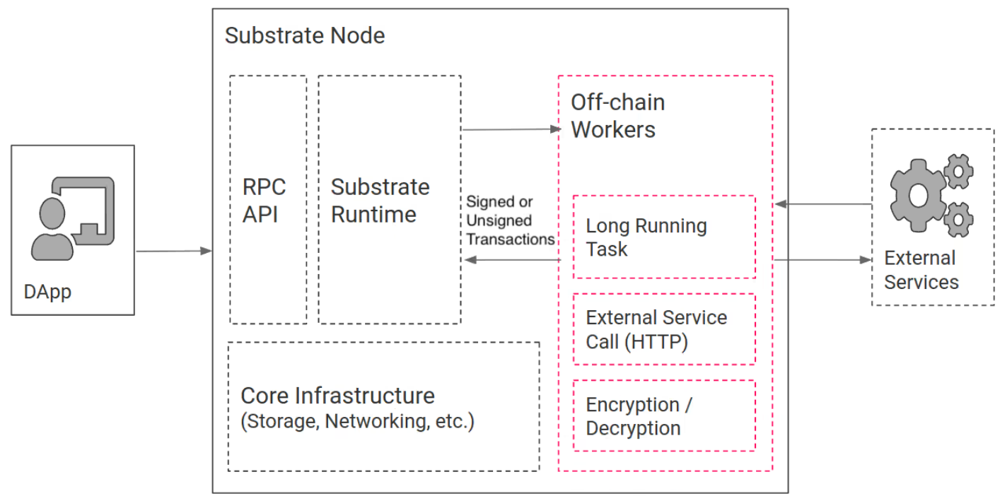

很多时候，需要在链下数据纳入链上状态之前，就进行查询和/或处理链下数据。通常的做法是通过预言机。预言机是外部服务，通常监听区块链事件并相应地触发任务。当这些任务完成后，其结果将通过交易提交回区块链。虽然使用预言机是处理链下数据源的一种方法，但预言机所提供的安全性、可扩展性和基础设施效率存在一些限制。

**链下工作机 （off-chain worker）** 允许执行长时间运行或具有不确定性的任务，例如：网站服务请求、数据的加密、解密和签名、随机数生成、CPU 密集计算、链上数据的枚举/聚合等。
链下工作机允许执行长到超过区块执行时间的任务。如果业务逻辑的处理时间可能达到上限，链下工作机可能就是一个合适的解决方案。

链下工作机对链下存储（Off-chain storage）具有读写访问权限。链上逻辑（On-chain logic）通过链下索引具有写入权限，但没有读取权限。 链下存储允许不同的工作线程相互通信，并存储特定于用户或特定于节点的数据，而无需在整个网络上达成共识。

链下索引（off-chain indexing）允许运行时（如果选择加入）直接写入链下存储，与链下工作机独立。它作为链上逻辑的临时存储，是其链上状态的补充。这意味着，如果链下工作机想要更改链上状态，需要通过调用交易来进行更改。而如果想不花本次交易的 gas 费，那么使用无签名交易将成为首选。

但是需要注意的是，链下工作机的执行需要消耗额外的计算机资源，如果不合理地开启多个链下工作机进程，可能会导致计算机停止服务。

# 工作原理

链下操作功能是在 Substrate Runtime 以外的 wasm 执行环境中运行。这种分离确保区块生成不会受到长时间运行的链下任务的影响。 然而，由于链下操作功能也是定义在 runtime 代码逻辑内，他们可以轻松访问链上状态以进行计算。



链下工作机可以通过访问扩展 API 与外部世界进行通信：

- 能够将已签名或未签名的交易提交到链以发布计算结果。
- 它具备一个功能齐全的 HTTP 客户端，允许工作人员从外部服务访问和获取数据
- 可以访问本地的密钥库来对交易进行签名和验证。
- 在所有 Off-chain Workers 之间共享的附加本地键值数据库。
- 用于随机数生成的安全本地熵源。
- 访问节点的精确本地时间。
- 睡眠和恢复工作的能力。

请注意，off-chain Worker 的结果不受常规交易验证的约束。因此，您应该确保链下操作包含一种验证方法来确定哪些信息进入链中。 例如，您可以通过实施投票、平均或检查发件人签名的机制来验证链下交易。

您还应该注意，默认情况下，Off-chain Workers 没有任何特定的特权或权限，因此代表了恶意用户可以利用的潜在攻击媒介。 在大多数情况下，在写入存储之前检查交易是否由 Off-chain Workers 提交不足以保护网络。不要认为 Off-chain Workers 可以在没有安全措施的情况下被信任，您应该有意设置限制性权限来限制对流程的访问及其可以做的事情。

 Off-chain Workers 的线程将在每次区块导入期间生成。但是，它们不会在初始区块链同步期间执行。

# 链下存储

链下存储始终位于本地节点，而不与任何其他区块链节点在链上共享或受制于共识。您可以使用具有读写访问权限的链下工作线程或使用链下索引的链上逻辑来访问链下存储中存储的数据。

# 应用示例

在 CESS 网络中，生成随机挑战的过程交由 off-chain worker 执行。每一次当前的验证节点都会生成一个 off-chain worker 线程。同时为防止链下工作期间重复操作，使用 Substrate 框架提供的链下存储为工作期间上锁，锁定示例方法如下:

```rust
fn check_working(now: &BlockNumberOf<T>, authority_id: &T::AuthorityId) -> bool {
  let key = &authority_id.encode();
  let storage = StorageValueRef::persistent(key);

  let res = storage.mutate(|status: Result<Option<BlockNumberOf<T>>, StorageRetrievalError>| {
    match status {
      // we are still waiting for inclusion.
      Ok(Some(last_block)) => {
        let lock_time = T::LockTime::get();
        if last_block + lock_time > *now {
          log::info!("last_block: {:?}, lock_time: {:?}, now: {:?}", last_block, lock_time, now);
          Err(OffchainErr::Working)
        } else {
          Ok(*now)
        }
      },
      // attempt to set new status
      _ => Ok(*now),
    }
  });

  if res.is_err() {
    log::error!("offchain work: {:?}", OffchainErr::Working);
    return false
  }

  true
}
```

执行期间，由 off-chain worker 计算出本轮挑战的范围，随机数，以及记录快照后，将信息打包后，调用交易依次存储至链上。
