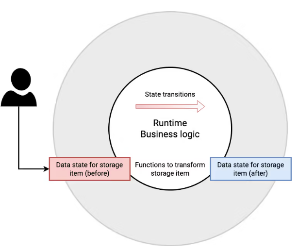

Runtime 是 substrate 的核心，它包含保存交易状态，执行交易，与外部节点交互的所有业务逻辑。Substrate 框架提供了所有用于区块链开发的组件，因此，基于 substrate 框架的开发者专注于编写runtime 的业务逻辑即可。

# 状态转换 与 Runtime

从最基本的层面上看，每个区块链的本质都是一个账本，记录发生在链上的每一个变化。在 Substrate 中，这些状态变换会在 runtime 记录下来。因为runtime负责这个操作，所以 runtime 有时又被撑为提供状态转换的函数。



在执行过程中，runtime 判断交易的有效和无效，以及链状态该如何根据交易结果进行转变。

# Runtime 接口


外部节点负责处理节点发现、交易池、交易广播、共识，并响应来自外部世界的 RPC 调用。这些任务经常需要外部节点查询 runtime 以获取信息或向 runtime 提供信息。runtime API 促进了外部节点和 runtime 之间的这种通信。

在 Substrate 中，`sp_api` crate 提供了一个接口来实现 runtime API。它旨在通过 [`impl_runtime_apis`](https://paritytech.github.io/substrate/master/sp_api/macro.impl_runtime_apis.html) 宏为您定义自己的自定义接口提供灵活性。然而，每个 runtime 都必须实现 [`Core`](https://paritytech.github.io/substrate/master/sp_api/trait.Core.html) 和 [`Metadata`](https://paritytech.github.io/substrate/master/sp_api/trait.Metadata.html) 接口。除了这些必需的接口外，大多数 Substrate 节点 (如 Substrate Node Template) 实现以下 runtime 接口：

- [`BlockBuilder`](https://paritytech.github.io/substrate/master/sp_block_builder/trait.BlockBuilder.html)，用于构建块所需的功能。
- [`TaggedTransactionQueue`](https://paritytech.github.io/substrate/master/sp_transaction_pool/runtime_api/trait.TaggedTransactionQueue.html)，用于验证交易。
- [`OffchainWorkerApi`](https://paritytech.github.io/substrate/master/sp_offchain/trait.OffchainWorkerApi.html)，用于启用链下操作。
- [`AuraApi`](https://paritytech.github.io/substrate/master/sp_consensus_aura/trait.AuraApi.html)，用于使用轮流一致性方法进行块编写和验证。
- [`SessionKeys`](https://paritytech.github.io/substrate/master/sp_session/trait.SessionKeys.html)，用于生成和解码会话密钥。
- [`GrandpaApi`](https://paritytech.github.io/substrate/master/sp_consensus_grandpa/trait.GrandpaApi.html)，用于将块最终化到 runtime 中。
- [`AccountNonceApi`](https://paritytech.github.io/substrate/master/frame_system_rpc_runtime_api/trait.AccountNonceApi.html)，用于查询交易索引。
- [`TransactionPaymentApi`](https://paritytech.github.io/substrate/master/pallet_transaction_payment_rpc_runtime_api/trait.TransactionPaymentApi.html)，用于查询有关交易的信息。
- [`Benchmark`](https://paritytech.github.io/substrate/master/frame_benchmarking/trait.Benchmark.html)，用于估计和测量完成交易所需的执行时间。

# 核心基础类型 (Core Primitives)

Substrate 定义了 runtime 必须实现的核心基础类型（core primitives）。Substrate 框架对 runtime 需要向 Substrate 的其他层提供哪些内容做了最少的假设。但是，有几个数据类型必须被定义，并且必须满足特定的接口以在 Substrate 框架内运作。

这些核心类型包括：

- `Hash`: 一种编码某些数据的密码摘要类型。通常只是一个 256 位的数量。
- `DigestItem`: 一种类型，必须能够编码一些与共识和更改跟踪相关的“硬连线”备选项，以及任何与 runtime 内特定模块相关的 “软编码” 变体。
- `Digest`: 一系列的 DigestItems。它编码了轻节点在块内必须拥有的所有相关信息。
- `Extrinsic`: 一种类型，通常代表交易，用于表示区块链识别的单个外部数据。通常涉及一个或多个签名和某种编码的指令（例如用于转移资金所有权或调用智能合约）。
- `Header`: 一种类型，代表与块相关的所有信息（无论是密码学还是其他方式）。它包括父哈希、存储根和外部区块哈希树的根、摘要和块编号。
- `Block`: 本质上就是 Header 和一系列 Extrinsic 的组合，以及要使用的哈希算法的规范。
- `BlockNumber`: 一种类型，用于编码任何有效块具有的祖先总数。通常是 32 位的数量。

# 添加 Pallet 致 Runtime 中

开发人员可以自定义构建 pallet，实现自己所需的功能，当前 Substrate 框架提供了许多的预设 pallets，例如 [**System Pallet**](https://paritytech.github.io/substrate/master/frame_system)、[**Support Pallet**](https://paritytech.github.io/substrate/master/frame_support) 等基础 pallet，还有一些扩展功能性的 pallet，如支持智能合约的 [**Contracts Pallet**](https://paritytech.github.io/substrate/master/pallet_contracts)，管理帐户余额的 [**Balances Pallet**](https://paritytech.github.io/substrate/master/pallet_balances) 等。

将自定义的 pallet、或预设的 pallet 添加至runtime [`construct_runtime!`](https://paritytech.github.io/substrate/master/frame_support/macro.construct_runtime.html) 宏中：

```rust
construct_runtime!(
  pub enum Runtime where
    Block = Block,
    NodeBlock = opaque::Block,
    UncheckedExtrinsic = UncheckedExtrinsic
  {
    // Basic stuff
    System: frame_system = 0,
    RandomnessCollectiveFlip: pallet_randomness_collective_flip = 1,
    Timestamp: pallet_timestamp = 2,
    // -- snapped --

    // CESS pallets
    FileBank: pallet_file_bank = 60,
    TeeWorker: pallet_tee_worker = 61,
    Audit: pallet_audit = 62,
    Sminer: pallet_sminer = 63,
    StorageHandler: pallet_storage_handler = 64,
    SchedulerCredit: pallet_scheduler_credit = 65,
    Oss: pallet_oss = 66,
    Cacher: pallet_cacher = 67,
  }
)
```

CESS 网络的模块是从第 60 号索引开始。

分别作用為：

- `FileBank`：管理网络中文件的元信息，包括 `idle`、`active` 這两种文件類型。
- `TEEWorker`：TEEWorker 是 CESS 网络中的组件之一，具备可信环境，负责计算文件 tag 和执行验证工作。该 pallet 负责管理 TEEWorker 的信息。
- `Audit`：這模塊用於检查网络中的文件是否正确的被存储，随机时间发起挑战，收集存储证明并对存储证明的验证任务分配，对验证结果进行处理。
- `Sminer`：存储节点是 CESS 网络中的角色之一，用于存储用户的数据，为网络提供存储算力。该pallet负责管理存储节点的信息，以及对其进行奖励或惩罚。
- `StorageHandler`：管理网络的存储算力，更新信息。存储着网络当前的总闲置空间、总服役空间、以及被用户购买的空间。并且提供交易接口，用于用户购买、续租、扩容空间。并通过 `Hooks` 让用户查询存储空间资讯。
- `SchedulerCredit`：TEEWorker 的信誉积分模块，为其他 pallets 提供增减 TEEWorker 信誉分的接口。
- `Oss`：**DeOSS** 是 CESS 网络的组件之一，用于为用户提供便捷的上传数据服务。该 pallet 负责管理 DeOSS 的相关信息及提供用户授权或取消授权的外部接口。单击此处了解有关 [DeOSS 服务](../../developer/guides/deoss.md) 的更多信息。
- `Cacher`：管理缓存矿工的信息，以及其相关的缓存订单。
