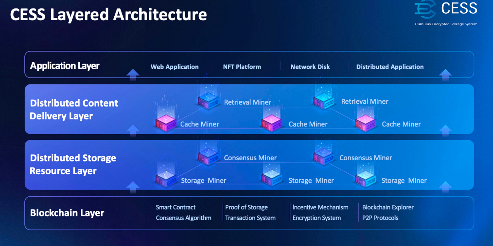
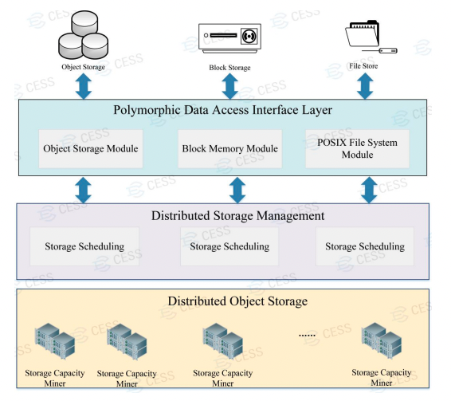
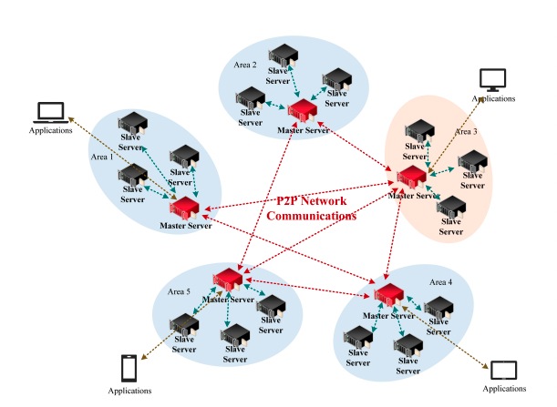
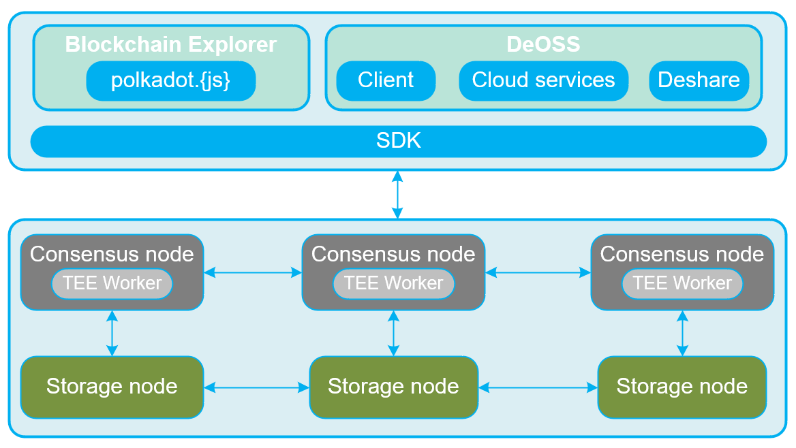

# 整体架构

CESS 提供大规模的存储容量，支持管理数十亿个数据文件，提供最大可达 100PB 的空间，以满足企业级的大规模存储需求。同时，CESS 提供数据服务，包括数据确权和隐私保护。因此，我们的平台不仅为 dAPP（去中心化应用程序） 提供可扩展的数据存储，还提供了强大的数据所有权保护。

如下图所示，CESS 采用分层和松耦合的系统架构，分为**区块链服务层、分布式存储资源层、分布式内容分发层和应用层。**

其中，**区块链服务层** 为整个 CESS 网络提供区块链服务，包括鼓励闲置的存储资源和计算资源加入 CESS 网络，为应用层提供数据存储、数据确权等服务。**分布式存储层** 采用虚拟化技术实现存储资源的集成和汇聚，其基础设施包括存储矿工和共识矿工。**分布式内容分发层** 使用内容缓存技术实现存储数据的快速传递，由检索和缓存矿工组成。**应用层** 为开发者提供 API/SDK 工具，以访问底层数据存储服务、区块链服务、网络驱动服务等。

## 区块链服务层

除了激励未使用的计算资源和存储资源加入 CESS 存储网络外，它还提供高效的区块链服务。CESS 提出了一种全新的随机选取轮值共识（R²S）算法，结合了异步拜占庭共识算法和图灵完备的智能合约以及跨链互操作能力。

实际上，这个区块链层在[区块链架构](blockchain-arch.md)中进行了更深入的分析。

## 分布式存储资源层

分布式存储资源是整个 CESS 网络最关键的硬件基础架构层。它管理来自世界各地矿工所贡献的存储资源，例如未使用或低使用率的服务器/台式机/笔记本电脑，构建了一个大规模的数据存储网络。该部分由存储调度节点/矿工和存储容量节点/矿工组成。存储调度节点存储元数据并提供快速数据索引，而存储容量节点提供数据存储空间。

CESS 旨在构建基于区块链的分布式云存储系统。其重点在于通过有效利用虚拟化技术来有效管理分布式资源，从而向客户提供一致高效的分布式存储服务。CESS 利用全球资源，并通过分布式身份信息使用户以统一方式访问数据网络。在实现方面，CESS 构建了两类基础架构节点：分布式云存储节点和分布式内容分发节点。分布式云存储网络提供大规模、可靠且可扩展的云存储；而分布式内容传送网络根据用户的地理位置传递数据，以实现快速访问。

## 分布式云存储网络

为满足不同的存储需求，CESS 设计和实现了多态数据存储访问接口，以 API 的形式为各种应用提供存储服务。如下图所示，在统一的分布式对象存储引擎之上，多态数据访问服务为上层应用提供对象存储、块存储和文件系统存储，以标准 API 的方式提供全面友好的数据存储服务支持。

CESS 提供了先进和可靠的去中心化对象存储服务。构建在其上的应用程序调用对象存储服务接口。对象存储模块自动完成用户对象存储空间到底层统一分布式对象存储空间的映射。用户数据以对象数据的形式存储在分布式对象存储引擎中。CESS 还将提供块设备存储服务。用户的块设备数据以对象数据的形式存储在分布式对象存储引擎中，支持快照、克隆等功能。

(todo: check if we need to update the image)

## 应用层

目前，我们的团队支持以下 dApp：

DeOSS：其技术架构在本文中进一步探讨。

我们欢迎其他团队充分利用 CESS **去中心化**云存储全栈解决方案的优势，并将 CESS 集成到他们的产品中。

For developed applications on CESS, please refer to the page [Role: Storage (dApp) User](../user).

We welcome other teams to leverage the advantage of the CESS solution and integrate CESS into their products.

# 逻辑架构

另一方面，可以将 CESS 视为具有以下逻辑结构。

如下图所示，逻辑架构由两个主要组成部分组成：一是 CESS 网络的核心功能系统，主要由共识节点和存储节点组成；另一个是在 CESS 生态系统中构建的应用程序，包括 CESS 区块链浏览器和**去中心化**对象存储服务，其中包括客户端、云服务、网关、Deshare 等应用。

- **存储节点**：主要负责提供空间、存储数据、和计算证明。
- **共识节点**：主要负责 CESS 网络的共识机制、交易执行、区块生成和验证。
- **TEE Worker**：主要负责数据标记，生成可验证且唯一的闲置数据用于空间验证。
- **SDK**：提供给开发者与 CESS 网络进行交互的开发工具。
- **区块链浏览器**：一个可视化界面，显示区块信息、交易详情、计算能力信息、账户信息等。
- **应用程序**：目前包括去中心化对象存储服务（DeOSS），提供在 CESS 网络上的对象存储服务。
