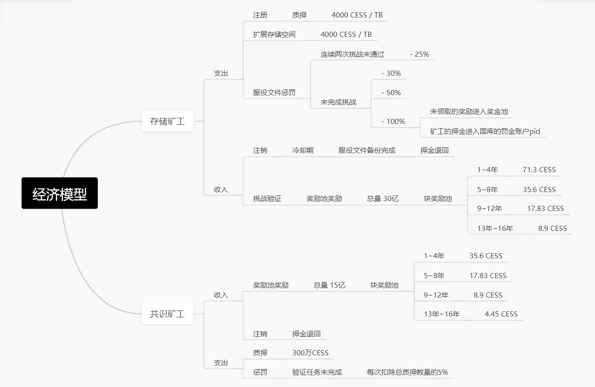

参考下面的CESS总体代币经济学：

CESS 网络将发行 **总计100 亿个代币**，其中 **30% 分配给存储矿工**，**15% 分配给共识矿工**。

在第一年，共发行 **1.875 亿个代币**，并在整年中每个 era 中均匀分发。总奖励每年以阶梯式减少，年衰减率为 0.841（0.50.25），即每四年奖励减半。

# 奖励

对于每个纪元（CESS 中持续 6 小时），矿工按照他们收集的纪元（era）点数的比例获得报酬。纪元（era）点数是通过可支付行为获得的奖励点数，例如：

- 产生主区块 (canonical blocks)。
- 产生对先前未引用的叔区块的引用。
- 产生被引用的叔区块。


叔区块是一个在各方面都有效的中继链区块，但未能成为主区块。当两个或多个验证器在同一时隙中成为区块生产者，并且其中一个验证器产生的区块在其他区块之前到达下一个区块生产者时，就会发生这种情况。我们称滞后的区块为叔区块。


每个纪元（era）结束时都会发放奖励。无论矿工的质押有多少，所有矿工都基本平均地分摊区块生产报酬。然而，特定矿工的报酬可能会根据时代点数有所不同，如上所述。尽管获得纪元（era）点数有一个概率性成分，并且它们可能会受到诸如网络连接等因素的轻微影响，但表现良好的矿工长远来看 era 内平均会拥有相若的纪元（era）点数总和。

矿工还可以从交易发送者那里获得“小费”，作为将交易包含在其产生的区块中的激励。矿工将直接获得这些小费的 100%。

# 惩罚

## 无响应

如果验证者在一个时期内没有产生任何区块并且未发送心跳信号，它将被报告为无响应。根据重复违规次数和该时期内其他验证者的无响应或离线情况，可能会发生削减惩罚。

验证者应该拥有良好的网络基础设施，以确保节点运行，降低削减或冷却的风险。最好有高可用性设置，最好有备份节点，仅在原始节点被验证为离线后才启动（以避免双重签名或歧义而被削减惩罚-见下文）。

这是计算因无响应而导致的削减的公式：

**x = 违规节点数量, n = 有效期内总验证节点数量**

$$\boxed{min (\cfrac{3 * (x - (\frac{n}{10} + 1))}{n}, 1) * 0.07}$$

## 歧义

GRANDPA 和 BABE 的歧义都是用相同的公式来计算惩罚:

- **GRANDPA 歧义**: 验证者在同一轮中对不同区块署两个或多个投票。
- **BABE 歧义**: 验证者在同一 slot 产生两个或以上的区块。

**x = 违规节点数量, n = 有效期内总验证节点数量**

$$\boxed{min((\cfrac{3 * x}{n})^2, 1)}$$

矿工可以在多台计算机上运行节点，以确保其中一台节点出现故障时另一台节点接入及时执行验证工作，但矿工操作人员在设置这些节点时应非常谨慎。如果他们没有良好的协调来管理签名机器，可能会发生歧义，而歧义违规的削减率要高于同程度的离线违规。

如果矿工因任何一项违规被举报，它将被从矿工集中移除（冷却），并且在它离开期间不会获得报酬。它们将立即被视为不活跃，需要重新发出验证意图。
