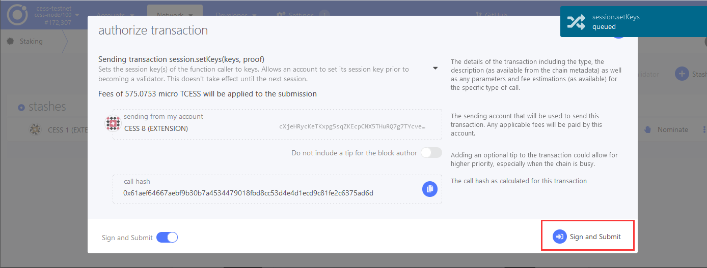

# 服务器要求

运行共识节点的服务器的推荐要求：

| 资源 | 规格 |
| --- | --- |
| 推荐操作系统 | Ubuntu_x64 20.04 或更高版本 |
| CPU 核心数 | ≥4 |
| 启用英特尔 SGX | 必需 |
| 内存（SGX加密内存） | ≥64GB |
| 带宽 | ≥5Mbps |
| 公网 IP | 必需 |
| Linux 内核版本 | 5.11 或更高版本 |


### SGX 支持

CPU 必须支持 [Intel Software Guard Extensions](https://www.intel.com/content/www/us/en/architecture-and-technology/software-guard-extensions.html) 及 Flexible Launch Control (FLC)。BIOS 必须支持 Intel SGX，并且必须启用 Intel SGX 选项。请参阅服务器制造商的 BIOS 指南以启用 SGX 功能。这里查看[支持 SGX 的 CPU 型号](https://ark.intel.com/content/www/us/en/ark/search/featurefilter.html?productType=873&2_SoftwareGuardExtensions=Yes)，包括 _Intel ME_，_Intel SPS_，或者 _同时是 Intel ME 和 Intel SPS_。</br>
*`CPU推荐型号：Intel E、E3、Celeron(部分型号)、Core系列CPU，其中Intel Core i5-10500最佳。`*</br>
*`主板BIOS推荐：supermicro等主流厂商`*

### 固网 IP

机器必须使用固定的公网 IP。流量出口必须与 IP 在同一网段。执行以下命令确认它们在同一网段。

```bash
curl ifconfig.co
```


# 准备 CESS 账户

## 决定您以哪种身份运行共识矿工
CESSv0.7.6版本后，用户可以选择以下身份运行共识矿工：
- **Full**：全节点具有全部的功能，用于兼容现有的TEE Worker类型，需要`绑定共识节点`进行注册；
- **Verifier**：验证型节点主要处理闲置和服役随机挑战，该类型必须`绑定共识节点`进行注册；
- **Marker**：认证型节点用于为用户服役文件计算Tag，处理闲置密钥生成，闲置认证和闲置替换工作，该类型可单独进行注册，服务于指定存储节点集群，***以该身份运行共识节点不增加信誉积分***；

以`Full`和`Verifier`运行共识矿工需要两个帐户。
- **Stash 帐户**: 需要至少从节点所有者或其他用户委托质押 300,000 TCESS 才能运行共识验证器。
- **Controller 帐户**: 需要至少 100 TCESS 来支付 Gas 费。

以`Marker`运行共识矿工需要一个账户。
- **Controller 帐户**: 仅需一笔用于注册交易的Gas费。

请参阅[创建 CESS 账户](../community/cess-account.md)，及前往[CESS 水龙头](https://cess.cloud/faucet.html)获取 TCESS，或[联系我们](../introduction/contact.md)获取 TCESS 代币进行质押。

创建钱包帐户后，导航至[CESS 浏览器](https://testnet.cess.cloud/)。

## 为 Stash 帐户绑定资金(绑定共识节点)

选择 **Network** ，点击 **Staking** > **Accounts** > **Stash**


选择 **Stash Account** 和 **Controller Account** 。

Value bonded：建议 300,000 TCESS。在 _payment destination_ 选择第二个选项 **Stash Account as the reward receiving account (do not increase the amount at stake)**，即挖矿收入不会自动添加到质押中。


点击 **Bond** -> **Sign and Submit** 以连接 Stash Account 和 Controller Account 。


资金绑定成功


# 安装 CESS 客户端

`cess-nodeadm` 是一个 CESS 节点部署和管理程序，有助于部署和管理存储节点、共识节点和全节点，以简化所有 CESS 矿工的开发运营。

```bash
wget https://github.com/CESSProject/cess-nodeadm/archive/v0.5.1.tar.gz
tar -xvf v0.5.1.tar.gz
cd cess-nodeadm-0.5.1
sudo ./install.sh
```


请检查您是否使用的是[最新版本的 `cess-nodeadm`](https://github.com/CESSProject/cess-nodeadm/tags)。目前是 **v0.5.1**。


如果出现 `Install cess nodeadm success` 消息，则表示安装成功。

如果安装失败，请查看[故障排除步骤](../storage-miner/troubleshooting.md)。

# 配置CESS客户端

运行:

```bash
cess config set
```

下面是以`Full`身份运行矿工的操作示例:</br>
*`tips:当current默认值合适时，您可以按回车键跳过`*

```bash
Enter cess node mode from 'authority/storage/watcher' (current: authority, press enter to skip): authority
Begin install sgx_enable ...
Intel SGX is already enabled on this system
Enter cess node name (current: cess, press enter to skip): cess
Enter cess chain ws url (default: ws://cess-chain:9944):
Enter listener port for kaleido (current: 10010, press enter to skip):
Start configuring the endpoint to access kaleido from the Internet
  Try to get your external IP ...
##此步骤会自动检测您机器IP，若自动检测不正确请您将正确的http://ip:port填入，其中port为上一步您设置的值，当然您也可以将endpoint设置为域名。
Enter the kaleido endpoint (current: http://221.122.79.3:10010, press enter to skip):
##current为null代表为空，当您想成为Marker的时候可以直接回车跳过
Enter cess validator stash account (current: null, press enter to skip): cXic3WhctsJ9cExmjE9vog49xaLuVbDLcFi2odeEnvV5Sbq4f
Enter what kind of tee worker would you want to be [Full/Verifier]: Full
Enter cess validator controller phrase: xxxxxxxxxxxxxx
❤️  Help us improve TEE Worker with anonymous crash reports & basic usage data? (y/n) : y
Set configurations successfully
Start generate configurations and docker compose file
debug: Loading config file: config.yaml
info: Generating configurations done
info: Generating docker compose file done
e1f4b19325de7526801573bc31e04e3aa54cbac7af1971c2be83f8da0c16e85c
Configurations generated at: /opt/cess/nodeadm/build
try pull images, node mode: authority
download image: cesslab/cess-chain:testnet
testnet: Pulling from cesslab/cess-chain
96d54c3075c9: Already exists
224698f4f3fe: Already exists
fe59e467d907: Pull complete
4f4fb700ef54: Pull complete
Digest: sha256:39821a9755ecc0c8901809e8a29454ec618ac73592818d3829abdf73ded4e89e
Status: Downloaded newer image for cesslab/cess-chain:testnet
docker.io/cesslab/cess-chain:testnet
download image: cesslab/kaleido:testnet
testnet: Pulling from cesslab/kaleido
01085d60b3a6: Already exists
75b070fa4d64: Already exists
e0b98820ba1b: Pull complete
28557caa1da0: Pull complete
Digest: sha256:6d5c7b74a98208acc8a10ab833eef6c9a6977ed9b82e98aa08cdba732dd5ac05
Status: Downloaded newer image for cesslab/kaleido:testnet
docker.io/cesslab/kaleido:testnet
download image: cesslab/kaleido-rotator:testnet
testnet: Pulling from cesslab/kaleido-rotator
96526aa774ef: Already exists
5c097a021ba1: Already exists
ff32bfaa56d6: Pull complete
Digest: sha256:7b0b1c04942d92cd69cac2a01f29ea7a889f9c5784c6af847152b8818fc946e5
Status: Downloaded newer image for cesslab/kaleido-rotator:testnet
docker.io/cesslab/kaleido-rotator:testnet
pull images finished
```
配置终端节点时请填入您的TEE Worker服务器地址，默认是当前服务器，如果您还不清楚TEE Worker，请参考[节点角色介绍](../concepts/node-roles.md)。

如果配置过程失败，请参考[故障排除指南](../storage-miner/troubleshooting.md)。

# 管理验证节点生命周期

## 成为验证者

1. 启动共识节点<br/>

    ```bash
    cess start
    ```
2. 生成 session 密钥<br/>

    ```bash
    cess tools rotate-keys
    ```

    

    “result” 后面引号内的字段是 session 密钥 (Session Key)，后续操作时会用到。“localhost:9933” 是默认端口。<br/>

3. 设置 session 密钥<br/>

    导航到 [CESS 浏览器](https://testnet.cess.cloud), 选择 **Network** > **Staking** > **Accounts** > **Session Key**<br/>

    

    红框中填写 **Session Key**<br/>

    

    点击 **Sign and Submit**<br/>

    

4. 成为验证者<br/>

    导航到 [CESS 浏览器](https://testnet.cess.cloud), 选择 **Network** > **Staking** > **Accounts** > **Validate**<br/>

    

    

    在 _reward commission percentage_ 输入 **100**, 即表示奖励不会分配给其他人。<br/>

    在 _allows new nominations_ 下拉例表中选择 **No, block all nominations** 表示不会接受任何提名。<br/>

    再次单击 **Sign and Submit**.<br/>

    

    完成上述步骤后，打开 [CESS 浏览器](https://testnet.cess.cloud/)，点击 **Network** > **Staking** > **Waiting**.<br/>

    

    此时您将看到该节点已经出现在候选节点列表中。

## 兑换奖励

导航至 CESS 浏览器: **Network** > **Staking** > **Payouts** > **Payout**.


在 **Payouts** 页，单击 Payout 以发起付款。任何帐户都可以发起付款。



请在 84 era（测试网每个 era 24 小时）内领取奖励，即 84 天。在此期间未领取奖励的，将无法领取。


## 退出共识验证

1. 停止共识节点<br/>

    在 [CESS 浏览器](https://testnet.cess.cloud), 导航至：**Network > Staking > Account Actions > Stop**.<br/>

    

2. 清除 session 密钥<br/>

    在 [CESS 浏览器](https://testnet.cess.cloud), 导航至：**Developer -> Submission**<br/>

    

    在 _using the selected account controller_ 内选定要用的控制帐户，然后在 _submit the following extrinsic_，输入 **session** 并在旁边框中选 **purgeKeys()**。<br/>

    

    点击 **Submit Transaction** 来清除 session 密钥<br/>

    

## 赎回质押

1. 解绑资金<br/>

    28 个 eras 后（测试网每个 eras 为 24 小时），执行以下操作：在 [CESS 浏览器](https://testnet.cess.cloud/), 导航至：**Network > Staking > Account Actions > Unbond Funds**.<br/>

    

2. 停止 CESS 客户端<br/>

    ```bash
    cess stop
    ```

# 常用操作

## 启动共识节点

```bash
cess start
```

## 查询矿机状态

```bash
$ cess status

-----------------------------------------
 NAMES           STATUS
kld-agent       Up 2 minutes
kld-sgx         Up 2 minutes
chain           Up 2 minutes
watchtower      Up 2 minutes
-----------------------------------------
```

## 检查配置信息

```bash
cess config show
```

## 停止并删除所有服务

```bash
cess down
```

# 升级 CESS 客户端

## 停止并删除所有服务

```bash
cess stop
cess down
```

## 删除所有链数据


除非 CESS 网络已重新部署且确认数据可以清除，否则请勿执行此操作。


```bash
cess purge
```

## 更新 `cess-nodeadm`

```bash
wget https://github.com/CESSProject/cess-nodeadm/archive/<new-version>.tar.gz
tar -xvf <new-version>.tar.gz
cd cess-nodeadm-<new-version>
./install.sh --skip-dep
```

目前 [最新版本](https://github.com/CESSProject/cess-nodeadm/tags) 是 **v0.5.3**适配的CESS版本为v0.7.6。

## 拉取镜像

```bash
cess pullimg
```

# 问题&&解答

**Q**：我并不想将自己的IP地址暴露在链上该怎么做？</br>
**A**：您可以在`cess config set`过程中设置自己endpoint的时候将域名加入，例如您注册的域名为tee-xxx.cess.cloud，那么您可以在设置endpoint的时候填入http://tee-xxx.cess.cloud，随后脚本将询问您是否一键代理域名，您可以输入`y`实现一键代理，示例如下：
```bash
.....
Enter the kaleido endpoint (current: http://tee-xxx.cess.cloud, press enter to skip): http://tee-xxx.cess.cloud
Do you need to configure a domain name proxy with one click? (y/n): y
.....
```
当然您也可以自行配置nginx代理，请不要使用域名服务商的中间代理。

**Q**：我怎么知道程序有没有正常工作？</br>
**A**：您可以在区块浏览器中选择`Chain State`，通过该方法您可以查询到是否注册成功


**Q**：不想自动跟新程序该怎么做？</br>
**A**：在程序完全启动成功后，会有一个`watchtower`的服务代替用户代替用户管理本地服务，当CESS官方对某个组件进行更新的时候，`watchtower`将会拉取最新的程序自动升级，如果您不想使用自动升级功能，您可以在进行`cess config set`之前，使用如下命令禁止自动更新。
``` bash
##禁止更新kld-sgx服务，当您选择禁止自动更新kld-sgx而选择手动更新时，更新过程中请删除/opt/cess/authority/kaleido/key/encrypted/podr2_key内文件。
cess tools no_watchs kld-sgx

##禁止更新kld-agent服务
cess tools no_watchs kld-agent
```
您的每一次自动升级都意味着官方对共识矿工程序的bug修复，我们**非常不建议**您关闭自动升级功能，这可能导致您的服务**不可用**！