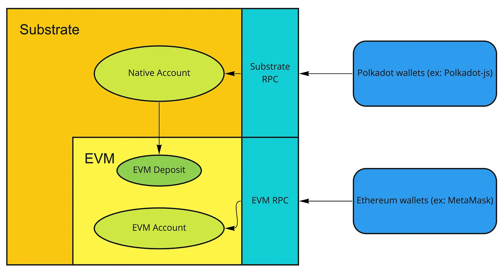
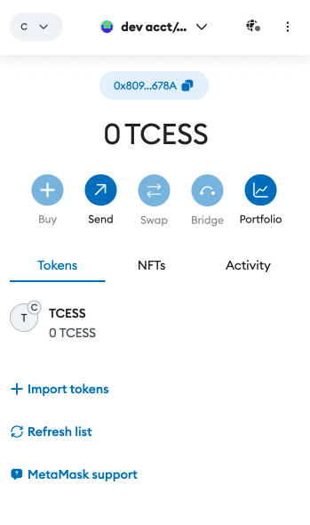
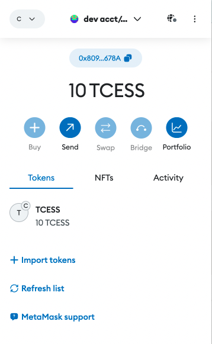
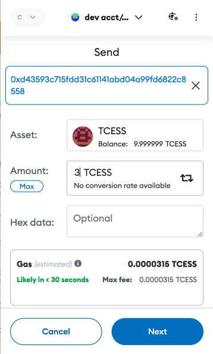

# 背景

CESS 网络是一个基于 Substrate 的网络，该网络允许开发人员部署 Solidity 合约并在以太坊虚拟机（EVM）上运行它们。该功能由 [Parity Frontier](https://github.com/paritytech/frontier) 实现的 **EVM Pallet** 和**以太坊 Pallet** 提供支持。

Substrate 底层默认使用 [SS58地址类型](https://wiki.polkadot.network/docs/learn-account-advanced)，该类型是比特币 Base-58-check 的修改。值得注意的是，该格式包含标识属于特定网络地址的地址类型前缀。

# Substrate 中的 EVM 集成

在深入研究地址转换方案之前，我们先看看是什么导致了这种地址转换的需求。

在 Substrate 架构中，[**EVM Pallet**](https://docs.rs/crate/pallet-evm) 是一个单独的 Substrate 模块，其账户和余额仅与主机 Substrate 区块链共享区块状态，如下所示：



这里有几点需要注意：

- EVM 环境在 Substrate 之上运行。这意味着 EVM 的区块高度取决于主机 Substrate 网络，主机Substrate 网络将能够访问 EVM 状态，但 EVM 将无法通过正常方式访问或改变主机 Substrate 网络的状态。

- EVM 环境公开其自己的 RPC 端点。该端点可以通过实现 Frontier RPC 客户端来公开，并且该端点与 [EIP-1474](https://github.com/ethereum/EIPs/blob/master/EIPS/eip-1474.md) 兼容，这意味着与以太坊配合使用的工具和站点将与 Substrate 内的 EVM 环境完全兼容。您可以使用 MetaMask 连接到网络并查看或发送代币，与其他与以太坊兼容的链上一样。

- EVM 环境有自己的余额，称为 EVM 存款，Substrate 原生账户可以提取该余额。原生 Substrate SS58 地址可以转换为映射到 EVM 存款的 H160 地址，EVM H160 地址也可以转换为 SS58 地址。这允许账户将代币从本机余额转移到 EVM 余额，反之亦然。但我们需要在这里手动进行地址之间的转换来实现传输。

# Substrate 和 EVM 地址转换

Substrate 地址的生成如下:


帐户 ID 长度为 32 字节。

另一方面，EVM 兼容地址的长度为 20 字节。它是通过以下方式生成的：


上图生成 EVM 地址，在取得 keccak256 摘要后，我们提取最后 20 个字节为以太坊地址 (见下面参考资料)。 请注意，最后使用的加密哈希函数是不同的。因此，为了在基于 Substrate 的网络中支持 EVM，需要有一种机制来转换地址并在它们之间转移余额。


参考上图, 我们的目标是 **从 Substrate 签名帐户转帐到 EVM 签名帐户 (#3), 然后再把资产返还**。

从 #1 **Substrate 签名帐户开始**。我们使用这个签名账户在 CESS 链上签署交易。这也是我们持有余额的主要 Substrate 账户。此 Substrate 帐户具有等效的 EVM 映射地址 (#4)。它是通过从 SS58 地址计算用户的公钥并提取其中的前 20 个字节来完成的。

用著名的开发账号`Alice`，它是根据众所周知的开发助记符生成的帐户（*不要在生产环境中使用它*）：

```
bottom drive obey lake curtain smoke basket hold race lonely fit walk
```

在 CESS 测试网，以上助记词生成的帐户有以下属性:

- 秘密种子（又名私钥）：`0xe5be9a5092b81bca64be81d212e7f2f9eba183bb7a90954f7b76361f6edb5c0a`
- 帐户 ID（又名发布密钥）：`0xd43593c715fdd31c61141abd04a99fd6822c8558854ccde39a5684e7a56da27d`
- SS58 地址: `cXjmuHdBk4J3Zyt2oGodwGegNFaTFPcfC48PZ9NMmcUFzF6cc`

Substrate 签名帐户的 EVM 映射地址 (#4) 将是帐户 ID 的前 20 个字节: `0xd43593c715fdd31c61141abd04a99fd6822c8558`。

---
我们再来说一下右边的地址转换图。我们需要一个 EVM 签名帐户，您可能会疑问能否将上述 EVM 映射地址 (#4) 导入到 EVM 钱包应用程序中。答案是**否定的**。这是因为我们不知道生成 EVM 映射地址 (#4) 的私钥。使用 `Alice`上面的秘密种子/私钥并将其导入 EVM 钱包并不能获得等效的 EVM 映射地址，而是新的地址。这是由于用于地址生成的不同哈希函数造成的。

因此，我们需要另一个新的 EVM 帐户。为了简化流程，我们将导入开发帐户的秘密种子 `Alice`（请记住这是一个单独的帐户）作为我们的 EVM 签名帐户。

我们将获得 (#3) 的 EVM 签名帐户`0x8097c3C354652CB1EEed3E5B65fBa2576470678A`。

为了获取 Substrate 映射地址，我们将使用[Hoon Kim](https://github.com/hoonsubin)开发的[Substrate EVM 地址转换器](https://hoonsubin.github.io/evm-substrate-address-converter/)。


进入应用程序，我们将地址方案设置为**H160** ，输入网络 ID 为 **11330** （CESS 测试网的链 ID），然后设置输入地址。我们将在底部获得 Substrate 映射的地址。它是：**cXgEvnbJfHsaN8HfoiEWfAi4QBENYbLKitRfG1CDYZpKTRRuw** (#2)。

现在我们有了四个账户，我们可以在账户组 1 (上图地址转换的左方) 和账户组 2  (上图地址转换的右方) 之间来回转移 CESS 代币。

# 从 Substrate 账户转入 EVM 账户

回想一下我们将使用的地址。

账户组 1:
- Substrate 签名地址: **cXjmuHdBk4J3Zyt2oGodwGegNFaTFPcfC48PZ9NMmcUFzF6cc** (#1)
- EVM 映射地址: **0xd43593c715fdd31c61141abd04a99fd6822c8558** (#4)

账户组 2:
- Substrate 映射地址: **cXgEvnbJfHsaN8HfoiEWfAi4QBENYbLKitRfG1CDYZpKTRRuw** (#2)
- EVM 签名地址: **0x8097c3C354652CB1EEed3E5B65fBa2576470678A** (#3)

1. 把 [Polkadot.js Apps](https://polkadot.js.org/apps/#/accounts) 连接到本地的 CESS 开发节点。开发账户 `Alice` 应有 100 MUNIT 的代币。


2. 将您的 EVM 钱包连接到 CESS 本地节点。在下面的示例中，我们将使用 [Metamask 钱包](https://metamask.io/)。首先，使用以下信息在 Metamask 中添加 CESS 本地网络：

    - Network Name: **CESS Localhost**
    - RPC URL: **http://localhost:9944**
    - Chain ID: **11330**
    - Currency Symbol: **TCESS**
    - Block explorer URL: leave it as blank

3. 添加网络后，使用以下私钥在 Metamask 中导入新帐户：

    `0xe5be9a5092b81bca64be81d212e7f2f9eba183bb7a90954f7b76361f6edb5c0a`

    现在您应该会看到一个账户 ID 为 `0x8097c3C354652CB1EEed3E5B65fBa2576470678A`、余额为 0 的账户。这是我们的 EVM 签名地址 (#3)。<br/>

    

4. 我们将从 `Alice` (#1) 转移 10M 代币单位到 Substrate 映射地址 `cXgEvnbJfHsaN8HfoiEWfAi4QBENYbLKitRfG1CDYZpKTRRuw` (#2)


5. 完成转账并等待几秒钟后，打开 EVM 钱包，我们应该看到 EVM 帐户的余额已更新以反映转账。

    在 Substrate 签名帐户 (#1) 上：<br/>

    

    在 EVM 签名帐户 (#3)上：<br/>

    

# 从 EVM 账户转入 Substrate 账户

1. 现在我们要转回一些 ERC-20 TCESS 代币并将其提取到我们的 Substrate 签名账户。在 EVM 钱包应用程序中，将 3 个 TCESS 转回 EVM 映射地址 `0xd43593c715fdd31c61141abd04a99fd6822c8558` (#4)。

    

2. 现在，在 Polkadot.js App 端，让我们使用 Alice 的账户发出外部函数 `evm.withdraw` 来提取 ERC-20 代币并将其转换回链原生代币。将以下内容作为参数：

    - address: 我们的 EVM 映射地址：**0xd43593c715fdd31c61141abd04a99fd6822c8558**
    - value: 提现金额，**2500000000000000000**.

    

3. 调用函数处理完成后，我们应该看到 Alice 的账户从 90M 更新到 9250 万个单位。

    

# 参考资料

- [在 Substrate 和 EVM 之间使用账户](https://medium.com/astar-network/using-astar-network-account-between-substrate-and-evm-656643df22a0)

- [Moonbeam 的统一地址](https://docs.moonbeam.network/learn/features/unified-accounts/)

- [S/E: 以太坊地址是如何生成的?](https://ethereum.stackexchange.com/questions/3542/how-are-ethereum-addresses-generated)
