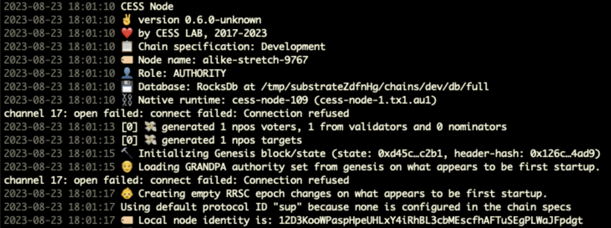
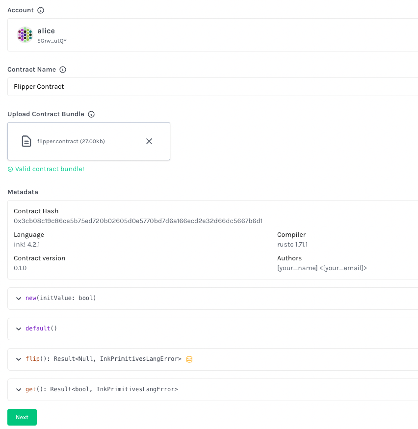
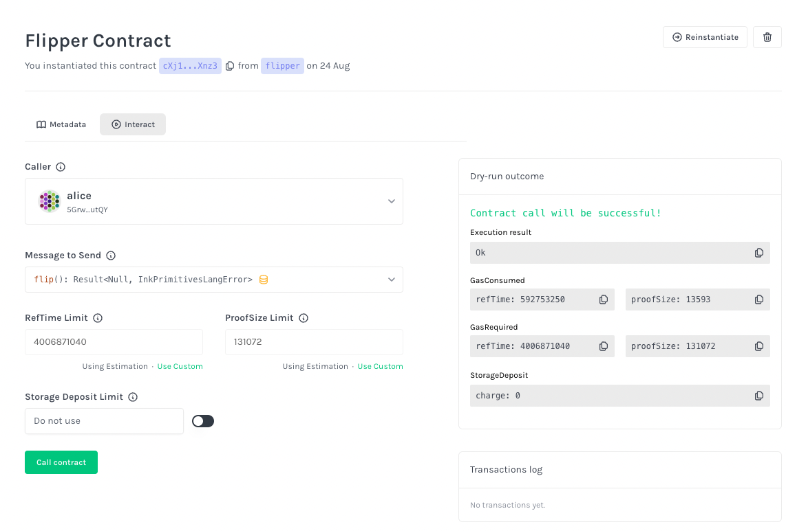

## 准备条件

- 安装 **rust** 语言和 **cargo** 。您也可以查看 [官方指南](https://www.rust-lang.org/tools/install) 了解操作详情。

   ```bash
   curl --proto '=https' --tlsv1.2 -sSf https://sh.rustup.rs | sh
   ```

- 接下来，安装 `cargo-contract`，这是一个帮助设置和管理用 ink! 编写的 WebAssembly 智能合约的 CLI 工具。打开 [GitHub 库](https://github.com/paritytech/cargo-contract) 了解更多。

   ```bash
   # Install an additional component `rust-src`
   rustup component add rust-src
   # Install `cargo-contract`
   cargo install cargo-contract --force --locked cargo-contract
   # Install `dylint`, a linting tool
   cargo install cargo-dylint dylink-link
   ```

- 运行以下命令验证安装是否成功：

   ```bash
   cargo contract --help
   ```

   这里应该显示本指令的帮助信息。

# 创建智能合约

我们将使用先前在 `cargo-contract`步骤中下载的包，去创建一个新的智能合约项目。运行以下命令：

```bash
cargo contract new flipper
```

此命令生成以下目录包含了三个文件

```
flipper
  ∟ .gitignore
  ∟ Cargo.toml
  ∟ lib.rs
```

查看一下档案 `Cargo.toml` 和 `lib.rs`，可看到本合约的依赖库和源代码。

接下来，我们将编译代码并运行其中的测试用例 `lib.rs`，以检查一切是否正常工作。

```bash
cd flipper
cargo test
```

如果您看到以下输出，意味着所有测试用例都已通过。

```
running 2 tests
test flipper::tests::it_works ... ok
test flipper::tests::default_works ... ok

test result: ok. 2 passed; 0 failed; 0 ignored; 0 measured; 0 filtered out; finished in 0.00s

  Doc-tests flipper

running 0 tests

test result: ok. 0 passed; 0 failed; 0 ignored; 0 measured; 0 filtered out; finished in 0.00s
```

我们现在可以编译合约代码：

```bash
cargo contract build
```

编译完成后，输出的文件存储在 `target/ink/` 目录中。共有三个关键输出文件：

- `flipper.wasm` - wasm 二进制文件。
- `flipper.json` - 包含合约 ABI 的元数据文件。
- `flipper.contract` - 捆绑上述两个文件的合约代码。

您还可以使用 `cargo contract build --release` 进行部署，但就目前的情况，部署 debug 版本已经足够了。

# 部署智能合约

- 在开发模式下运行本地 [CESS 节点](https://github.com/CESSProject/cess)。执行以下命令克隆 CESS 节点源代码，编译，并运行本地节点。

   ```bash
   # Select the appropriate/latest git tag from the git repository
   git clone https://github.com/CESSProject/cess.git --branch v0.6.0
   cd cess
   # The build process will take probably 10 mins depending on your machine spec
   cargo build
   target/debug/cess-node --dev
   ```

   节点开始运行，指令行页面将显示如下内容。

   

- 我们将使用 [**Substrate Contracts UI**](https://github.com/paritytech/contracts-ui) 来部署 ink! 智能合约并与其交互。Substrate Contracts UI 是一个由 Parity 开发的 UI 工具。让我们通过以下方式将 Substrate Contracts UI 连接到本地 CESS 节点：

   <https://contracts-ui.substrate.io/?rpc=ws://127.0.0.1:9944>

   

- 单击 **“Upload a new contract”**。

- 然后在下一页中:
   - 在 *Account* 下拉单中，选择 **alice** 以 Alice 的身份部署合约。
   - 在 **“Contract Name”** 文字框里把值定为 **Flipper Contract**
   - 在 *Upload Contract Bundle* 中，拖拽或打开文件 **target/ink/flipper.contract**。

   选择正确的合同文件后，您应该会看到合同元数据。然后单击 **Next**。

   

- CESS 区块链（以及基于 Substrate 的链）处理 ink! 合约与其他 EVM 兼容链的传统方法不同。合约代码上传和实例化分为两个步骤。在 CESS 链中，您能拥有一份智能合约代码副本，却有着多个不同初始配置的该智能合约的实例，从而节省区块链空间并鼓励代码重用。

  在下面这屏幕中，我们将代码上传和合约实例化放在一个步骤中。

   - *Deployment Constructor*: 选择 **new(initValue: bool)**
   - *initValue: bool*: 选择 **false**
   - 其他选项不做变动，点击 **Next**

   

- 在下一页中，确认一切正常，然后单击 **Upload and Instantiate**。

   

- 您已成功完成实例化示例 Flipper 合约，并可以在此页面中与其交互。

   

# 参考

- [**ink!** 官方文档](https://use.ink/)
- [CESS 节点代码库](https://github.com/CESSProject/cess)
- [ink! 示例代码库](https://github.com/paritytech/ink-examples)
- [Substrate Contracts UI 代码库](https://github.com/paritytech/contracts-ui)
