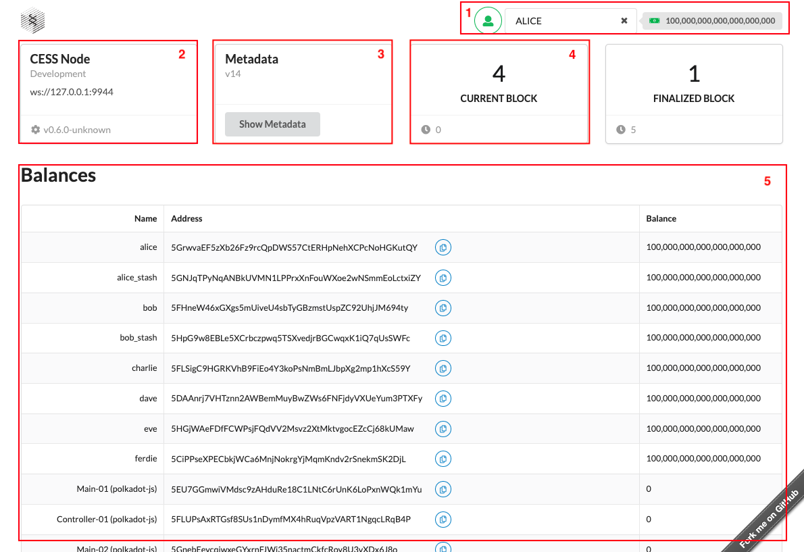

# 目标

在本教程中，我们将阐述如何开发出一份 [ink! 智能合约](https://use.ink/)、使用 [React](https://react.dev/) 编写前端的 dApp 的开发全过程。我们还将介绍如何在 CESS 本机节点上部署智能合约，并让前端与之交互。

我们将开发的应用程序是一个基于存在证明（Proof of Existence, 简称：PoE）的 dApp，PoE 用于证明：1）一个人是特定文件的持有者；2）该文件的内容与过去在链上发布时的内容相同。要明白第二点的作用，只需考虑到其中一个场景为有需要证明用户现时的合同文件和过去发布上链时的内容一模一样，没被篡改过。

我们不会将整份文件内容发布到链上，而是提取文件内容的前 64kB，将其传递给哈希函数，并声明该文件的所有权。用户还可以在链上发送交易，以检索自身拥有的文件列表并检查文件是否已被认领。注意这种哈希使用法只适用于现在这个展示用例。在生产环境上这种使用方法是不安全的。



本教程的完整代码可在 [代码库](https://github.com/CESSProject/cess-examples/tree/main) 查看。

- 智能合约部分，位于 [`ink/poe` 目录](https://github.com/CESSProject/cess-examples/tree/main/ink/poe).
- 前端部分，位于 [`src/ProofOfExistenceInk.js`](https://github.com/CESSProject/cess-examples/blob/main/frontend/src/ProofOfExistenceInk.js).



我们首先编写 ink! 智能合约，再编写前端部分。现在开始吧！

# ink! 智能合约

## 准备条件

本教程与教程 [《部署 ink 智能合约》](./deploy-sc-ink.md#prerequisite) 的准备条件一致，请按照那部分进行操作，安装所有必需的组件：Rust 和 `cargo-contract`。

## 开发

1. 首先构建目录结构

    ```bash
    mkdir poe-ink
    cd poe-ink
    cargo contract new contract
    ```

    最后一行命令将构建一个 ink! 合约项目的目录架构。

    构建的目录里有三个文件。

    ```
    poe-ink/contract/
      ∟ .gitignore    # contains files to ignore when committing to git
      ∟ Cargo.toml    # This is a Rust project, so there is a `Cargo.toml` file for the project specification.
      ∟ lib.rs        # The actual smart contract and unit test code.
    ```

    `lib.rs` 很有意思，是一个读取和转换 boolean 值的简单合约。请快速浏览这档案以了解 ink! 合约代码的整体结构。

2. 构建并测试合约项目。

    ```bash
    cd contract          # In case you haven't gotten inside the contract dir.
    cargo contract build # This command builds the contract project.
    cargo test           # This command runs the unit test code starting at the `mod tests` line in the code.
    ```

    运行 `cargo contract build` 生成三个文件：

    - `contract.wasm`: 合约代码
    - `contract.json`: 合约元数据
    - `contract.contract`: 合约代码和元数据

    前端（参见下一节）需要阅读 `contract.json` 合约的 API。我们将用 `contract.contract` 在链上实例化合约。

3. 打开 `lib.rs`，删除所有内容，只保留顶层结构。所以我们将得到：

    ```rs
    #![cfg_attr(not(feature = "std"), no_std, no_main)]

    #[ink::contract]
    mod contract {
      // We will fill up the code here next
    }
    ```

4. 在智能合约开发中，其中两个关键是 决定存储数据结构及它对外发出的事件。让我们思考一下 PoE 的功能，我们需要一个从用户地址到文件数组的存储映射，标明他们所拥有的文件的哈希摘要，以及从哈希摘反向追朔回其持有者的反向映射。这里我们限制一份文件只能最多被一名用户所拥有。以下的存储结构支持这些功能：

    ```rs
    mod contract {
      // The following two lines are added to import the support of vector `Vec` and `Mapping` data structure.
      use ink::prelude::{vec, vec::Vec};
      use ink::storage::Mapping;

      #[ink(storage)]
      pub struct Contract {
        /// Mapping from AccountId to hash digest of files the user owns
        users: Mapping<AccountId, Vec<Hash>>,
        /// Mapping from the file hash to its owner
        files: Mapping<Hash, AccountId>,
      }
    }
    ```

    我们使用 `#[ink(storage)]` 属性宏告诉 Rust 编译器这是智能合约存储，编译器将在这里进一步处理存储规范。[点击此处](https://github.com/paritytech/ink#ink-macros--attributes-overview) 了解更多 ink! 所支持使用的属性宏。

5. 现在，我们希望智能合约在用户成功声明文件所有权时发出事件。我们还实现用户可放弃持有某份文件的拥有权。所以这里定义两个事件：

    ```rs
    mod contract {
      // ... below the storage data structure code

      #[ink(event)]
      pub struct Claimed {
        #[ink(topic)]
        owner: AccountId,
        #[ink(topic)]
        file: Hash,
      }

      #[ink(event)]
      pub struct Forfeited {
        #[ink(topic)]
        owner: AccountId,
        #[ink(topic)]
        file: Hash,
      }
    }
    ```

    我们定义的两个事件：

    - **Claimed**：当事件被发出时，也把相关的用户帐号和文件摘发出。
    - **Forfeited**：与上面相同，相关的用户帐号和文件摘发出。

6. 接下来，研究一下智能合约的核心逻辑

    ```rs
    mod contract {
      // ... below the event code

      impl Contract {
        /// Constructor to initialize the contract
        #[ink(constructor)]
        pub fn new() -> Self {
          let users = Mapping::default();
          let files = Mapping::default();
          Self { users, files }
        }

        #[ink(message)]
        pub fn owned_files(&self) -> Vec<Hash> {
          let from = self.env().caller();
          self.users.get(from).unwrap_or(Vec::<Hash>::new())
        }

        #[ink(message)]
        pub fn has_claimed(&self, file: Hash) -> bool {
          match self.files.get(file) {
            Some(_) => true,
            None => false,
          }
        }
      }
    }
    ```

    这里我们定义了三个方法：

    - `fn new()`: 智能合约构造函数。该函数将在智能合约实例化时被调用。它在函数的正上方标有属性宏。`#[ink(constructor)]`。

    - `fn owned_files(&self)`: 该函数返回一个向量，即 Rust 中所说的哈希摘要数组。该函数首先检索智能合约的调用者，使用它作为密钥在 **`users`** 的存储映射中检索其值，然后返回该值。如果未找到值，则返回空向量。请注意，此函数不接受 `AccountId` 参数，因此调用者只能检查自己的文件所有权。

    - `fn has_claimed(&self, file: Hash)`: 该函数返回一个 boolean 值，指示由哈希指定的文件是否已被某个用户认领。我们使用文件哈希作为密钥从 **`files`** 智能合约存储中读取数据，并查看是否可以检索所有者。如果有，则说明该文件已被认领，并且该函数返回 true。否则，返回 false。请注意，我们仍需指定要使用的哈希函数以及文件如何转换为其哈希摘要。这是前端执行的工作，因此我们将在下一节处理它。

7. 现在我们来研究一下核心逻辑 `fn claim()`。它允许用户声明特定文件的所有权。整体逻辑是：

    - 我们首先检查该文件是否尚未被认领。
    - 我们更新存储 `files` 并 `users` 标明现在这文件属于当前调用者。
    - 发出文件已被认领的事件，以便其他区块链侦听器知道这一点。

    下面的代码包含了上面所说的逻辑：

    ```rs
    mod contract {
      // ...previous code
      impl Contract {
        // ...previous code

        /// A message to claim the ownership of the file hash
        #[ink(message)]
        pub fn claim(&mut self, file: Hash) -> Result<()> {
          // Get the caller
          let from = self.env().caller();

          // Check the hash has yet to be claimed
          if self.files.contains(file) {
            return Err(Error::AlreadyClaimed);
          }

          // Claim the file hash ownership with two write ops
          // Update the `users` storage. If a vector is retrieved, we push the hash digest into
          //   the vector. Otherwise, we create a new vector with the hash digest element inside.
          match self.users.get(from) {
            Some(mut files) => {
              // A user entry has already been built
              files.push(file);
              self.users.insert(from, &files);
            }
            None => {
              // A user entry hasn't been built, so building one here
              self.users.insert(from, &vec![file]);
            }
          }

          // Update the `files` storage
          self.files.insert(file, &from);

          // Emit an event
          Self::env().emit_event(Claimed { owner: from, file });

          Ok(())
        }
      }
    }
    ```

8. `fn claim()` 的返回值类型看起来与之前的两个函数 `fn owned_files()` 和 `fn has_claimed()` 不同。`fn owned_files()` 和 `fn has_claimed()` 是读取函数，只读取合约存储，不会产生更改。但是 `fn claim()` 是一个状态修改函数。它能返回 Rust 中的一个 [`Result` enum 类型](https://doc.rust-lang.org/std/result/enum.Result.html)。通过返回 `Ok(())` 表明函数已成功更改状态，或返回 `Err(error value here)` 表明发生了错误，状态更改已恢复。

    现在我们来定义错误值。合约中将发出两个错误值：`AlreadyClaimed` 出现在当用户尝试声明已声明过的文件，及 `NotOwner` 出现在当用户尝试放弃不是他们所拥有的文件所有权时。

    ```rs
    mod contract {
      // ... prev code

      // Beware that this part of the code is OUTSIDE of `impl Contract {}`, unlike the claim() function above.

      // Result type used in `fn claim()` is a short form.
      pub type Result<T> = core::result::Result<T, Error>;

      // These are two error values returned in our contract
      #[derive(Debug, PartialEq, Eq, scale::Encode, scale::Decode)]
      #[cfg_attr(feature = "std", derive(scale_info::TypeInfo))]
      pub enum Error {
        /// File with the specified hash has been claimed by another user
        AlreadyClaimed,
        /// Caller doesn't own the file with the specified hash
        NotOwner,
      }

      impl Contract {
        // ... prev code
      }
    }
    ```

9. `fn forfeit()` 函数基本是把上面 `fn claim()` 函数的操作反向操作一篇。

    - 我们首先检查调用者是否拥有该文件。如果没有，我们返回一个错误。
    - 我们更新 **`users`** 和 **`files`** 存储以删除文件哈希摘要。
    - 发出一个关于这个新状态的事件。

    ```rs
    mod contract {
      // ...previous code
      impl Contract {
        // ...previous code
        #[ink(message)]
        pub fn forfeit(&mut self, file: Hash) -> Result<()> {
          let from = self.env().caller();

          // Check if the caller owns the file. If not, return `Error::NotOwner`.
          match self.files.get(file) {
            Some(owner) => {
              if owner != from {
                return Err(Error::NotOwner);
              }
            }
            None => {
              return Err(Error::NotOwner);
            }
          }

          // Confirmed the caller is the file owner. Update the two storage `users` and `files`.
          let mut files = self.users.get(from).unwrap_or(vec![]);
          for idx in 0..files.len() {
            if files[idx] == file {
              files.swap_remove(idx);
              self.users.insert(from, &files);
            }
          }

          self.files.remove(file);

          // Emit an event
          Self::env().emit_event(Forfeited { owner: from, file });

          Ok(())
        }
      }
    }
    ```

10. 至此，您已经完成了智能合约的所有核心逻辑。编译合约 `cargo contract build` 以确保其能构建。如果对最终的源代码有任何疑问，您可以随时参考[完整的源代码](https://github.com/CESSProject/cess-examples/blob/main/ink/poe/lib.rs)。

11. 编译完成后，将合约 [部署到本地的 CESS 开发节点上](./deploy-sc-ink.md) 并与合约交互以对其进行测试。您可以访问 [Contracts UI](https://contracts-ui.substrate.io/)，将其连接到本地节点，然后部署合约。请参阅下面的屏幕截图。<br/>

    

    请确保：

    - 合约 UI 正在连接到本地 CESS 节点。
    - 上传 `contract.contract` 文件时, 看到预期的元数据。

**恭喜**！您已经完成了智能合约开发部分。在进行前端开发之前，完整的源代码还包含单元测试代码，里面的代码块 `mod tests { ... }`。我们不在此处赘述，您可以通过 `cargo test` 命令运行它们。请 [查看此处](https://use.ink/basics/contract-testing) 以了解有关合约测试的更多信息。

# 前端


## 准备条件

- 安装 [Git](https://git-scm.com/book/en/v2/Getting-Started-Installing-Git)
- 安装 [Node v18](https://nodejs.org/en/download)
- 安装 [pnpm](https://pnpm.io/installation), or your favorite package manager
- 运行 CESS 节点的本地开发链，因为前端将连接到本地CESS链。请参阅此处了解 [如何运行本地 CESS 链](./deploy-sc-ink.md#deploy-a-smart-contract).

我们将从 [Substrate Front End Template](https://github.com/CESSProject/substrate-front-end-template) 开始修改。

```bash
cd poe-ink    # This is the root directory created during the smart contract development above.
git clone https://github.com/CESSProject/substrate-frontend-template.git frontend
cd frontend
pnpm install  # pull all the project dependencies down

# Before starting the front end below, open another terminal window and start your local CESS node.
# Refer to ./deploy-sc-ink.md#deploy-a-smart-contract

pnpm start    # start the project
```

输入以上命令后，如您的屏幕和以下截图类似，我们可以继续下一步。


## 在开始之前

首先，如果有任何疑问，您可以随时查阅[**完整的前端源代码**](https://github.com/CESSProject/cess-examples/tree/main/frontend)。

为了对前端模板有一个概括性的理解，我们可参考 [`src/App.js` 的下半部分](https://github.com/CESSProject/cess-examples/blob/main/frontend/src/App.js#L51)：

```jsx
function Main() {
  // ...code snapped
  return (
    <div ref={contextRef}>
      <Sticky context={contextRef}>
        <AccountSelector />
      </Sticky>
      <Container>
        <Grid stackable columns="equal">
          <Grid.Row stretched>
            <NodeInfo />
            <Metadata />
            <BlockNumber />
            <BlockNumber finalized />
          </Grid.Row>
          <Grid.Row stretched>
            <Grid.Column>
              <Balances />
            </Grid.Column>
          </Grid.Row>
          <Grid.Row stretched>
            <Grid.Column width={8}>
              <Transfer />
            </Grid.Column>
            <Grid.Column width={8}>
              <Upgrade />
            </Grid.Column>
          </Grid.Row>
          <Grid.Row stretched>
            <Grid.Column width={8}>
              <Interactor />
            </Grid.Column>
            <Grid.Column width={8}>
              <Events />
            </Grid.Column>
          </Grid.Row>
          <Grid.Row stretched>
            <Grid.Column width={8}>
              <PoEWithInk />
            </Grid.Column>
            <Grid.Column width={8}>
              <PoEWithSolidity />
            </Grid.Column>
          </Grid.Row>
        </Grid>
      </Container>
      <DeveloperConsole />
    </div>
  );
}
```
让我们看看不同的组件是如何在屏幕上布局的。



1. 组件 `<AccountSelector/>`, 引用 `src/AccountSelector.js`.
2. 组件 `<NodeInfo />`, 引用 `src/NodeInfo.js`.
3. 组件 `<Metadata />`, 引用 `src/Metadata.js`.
4. 组件 `<Balances />`, 引用 `src/Balances.js`.

我们将添加一个新组件并展示如何使用 [**useink** Javascript 库](https://www.npmjs.com/package/useink) 将前端连接到智能合约。

## 开发

1. 通过以下方式添加 **useink** 依赖项：

    ```bash
    pnpm install useink
    ```

2. 在 `src/App.js中`，让我们将 `<TemplateModule />` 组件替换为 `<PoEWithInkProvider />`。删除 `TemplateModule` 导入行，并添加回 `PoEWithInkProvider`。我们还创建了一个基本的 React 框架 `src/ProofOfExistenceInk.js`。

    所以 `src/App.js` 变成：

    ```jsx
    // Remove/comment out this line
    // import TemplateModule from "./TemplateModule";
    // Add the following line
    import PoEWithInk from "./ProofOfExistenceInk";

    //... code snapped
    return (
      <div ref={contextRef}>
        { /* code snapped */ }
        <Container>
          <Grid stackable columns="equal">
            {/* code snapped */}
            <Grid.Row>
              <PoEWithInk />
            </Grid.Row>
          </Grid>
        </Container>
        {/* code snapped */}
      </div>
    )
    ```

    [`src/ProofOfExistenceInk.js`](https://github.com/CESSProject/cess-examples/blob/main/frontend/src/ProofOfExistenceInk.js) 如下所示:

    ```jsx
    import { React, useState } from "react";

    export default function PoEWithInkProvider(props) {
      return (<>Proof of Existence Ink! dApp</>);
    }
    ```

    至此，前端应该显示 “Proof of Existence Ink! dApp” 这一行。

3. 从现在开始，我们将主要关注在文件 `src/ProofOfExistenceInk.js`。我们不会在这里逐行添加代码，但我们会介绍 **useink** 库提供的 API，以方便与 ink！智能合约交互。

    参考代码：[`src/ProofOfExistenceInk.js`](https://github.com/CESSProject/cess-examples/blob/main/frontend/src/ProofOfExistenceInk.js)

4. 从 [文件底部](https://github.com/CESSProject/cess-examples/blob/main/frontend/src/ProofOfExistenceInk.js#L194-L201) 开始，我们有：

    ```jsx
    <UseInkProvider
      config={{
        dappName: "Proof of Existence (Ink)",
        chains: [{ id: "custom", name: "CESS localhost", rpcs: [config.PROVIDER_SOCKET] }],
      }}
    >
      <ProofOfExistenceInk />
    </UseInkProvider>
    ```

    `UseInkProvider` context Hook 提供 ink！与其子组件的合约连接信息。配置对需要以下参数：

    - `chains.id`: 存在具有知名 ID 的公链。当我们连接到本地开发链时，我们将其设置为 `custom`。
    - `chain.name`: 链的名称。提示钱包连接时会显示。
    - `chain.rpcs`: 我们从应用程序配置中获取该值，该值指向本地链 RPC 终端 `wss://localhost:9944`。

    透过 `UseInkProvider`，我们可以在 `<ProofOfExistenceInk />` 组件内调用 ink! 的 API 函数。

5. 在 [`function ProofOfExistenceInk(props) {...}`](https://github.com/CESSProject/cess-examples/blob/main/frontend/src/ProofOfExistenceInk.js#L31) 代码中来看：

    ```jsx
    // NOTE: In `examples/poe-ink/contract` directory, compile your contract with
    //   `cargo contract build`.
    import metadata from "../../ink/poe/target/ink/poe_ink_contract.json";

    // NOTE: Update your deployed contract address below.
    const CONTRACT_ADDR = "cXjN2RG7YEpxx1bCa4zJKy3igsh3DuEo8bHnfKp1KsH5LaUub";

    function ProofOfExistenceInk(props) {
      const { account } = useWallet();

      const balance = useBalance(account);

      // Getting the contract API
      const poeContract = useContract(CONTRACT_ADDR, metadata, "custom");
      const ownedFiles = useCallSubscription(poeContract, "ownedFiles");
      const ownedFilesRes = pickDecoded(ownedFiles.result);

      //... code snapped
    }
    ```

    - 用 `useWallet()` 获取当前智能合约连接账户。
    - 用 `useBalance(account)` 获取帐户的当前余额。
    - 用 `useContract(CONTRACT_ADDR, metadata, "custom")` 获取合同 ABI。
        - 合约地址 `CONTRACT_ADDR` 也是指定在档案里。因此，每次部署新的 PoE 合约时，我们都需要更新分配的地址值；
        - `metadata` 也以在上述代码中指定了，其来自我们 `cargo contract build` 智能合约时的元数据 json 文件；
        - `custom` 是部署合约的链 ID。

        至址, 我们就有了一个 `poeContract` 可以与之交互的合约实例。

    - 然后，我们使用智能合约函数 `useCallSubscription()` 订阅通过 `ownedFiles()` 功能从智能合约中返回的值。回忆上一节里，我们介绍过该函数用于返回用户帐户拥有的所有文件哈希摘要。

    - 我们使用 `pickDecoded()` 方法解码那结果，将链数据类型转换为 javascript 数据类型。

    这里提到的所有功能都是由 **useink** 库提供的。详细可参看 [**ink! 文档**](https://use.ink/frontend/hooks).

6. 接着我们来介绍如何计算文件哈希摘要。

    ```jsx
    const computeFileHash = (file) => {
      const fileReader = new FileReader();
      fileReader.onloadend = (e) => {
        // We extract only the first 64kB  of the file content
        const typedArr = new Uint8Array(fileReader.result.slice(0, 65536));
        setFileHash(blake2AsHex(typedArr));
      };
      fileReader.readAsArrayBuffer(file);
    };
    ```
    我们使用[`FileReader`](https://developer.mozilla.org/en-US/docs/Web/API/FileReader) 现代浏览器都有提供的 JS API 来读取上传的文件，提取前 64 kB，并使用 [**@polkadot/util-crypto**](https://polkadot.js.org/docs/util-crypto/examples/hash-data) 库提供的 `blake2AsHex()` [Blake2 加密哈希函数](https://en.wikipedia.org/wiki/BLAKE_(hash_function)#BLAKE2) 来计算其哈希摘要。

7. 然后，我们还扩展了一些辅助组件 **TxButton**、**ConnectWallet** 和 **WalletSwitcher** 来展示 UI。

    - **TxButton** 组件根据用户是否拥有该文件向链发送 `claim()` 或 `forfeit()` 交易。通过使用 `useTx()` 构建交易，然后使用 `signAndSend()` 来发送交易。

    - **ConnectWallet** 组件允许用户切换不同的钱包提供商，包括 Enkrypt、Polkadot.js 扩展、SubWallet 和 Talisman。一个典型的选择是使用 [Polkadot.js 扩展](https://polkadot.js.org/extension/)。<br/>

        

        It uses `useWallet()` to get the wallet connection function and `useAllWallets()` to get the information of all supported wallets.
        它用 `useWallet()` 获取钱包连接功能，并使用 `useAllWallets()` 获取所有支持的钱包信息。

    - **WalletSwitcher** 组件以 `accounts`对象取得在 **ConnectWallet** 已选取的钱包所有的可用账户。并使用 `setAccount()` 设置某个特定账户，同也可用 `disconnect()`断开与所选钱包的连接。

8. 最后，我们得到一个类似于以下页面的前端：<br/>

    

# 教程完成

**恭喜，您已顺利完成本教程**! 让我们回顾一下本教程：

- 您已成功用 ink! 智能合约实现了 PoE 逻辑并将其部署在本地 CESS 节点上。
- 从使用 Substrate 前端模板 和 **useink** React 库开始，您已经成功实现了与智能合约交互的前端。

现在，您可以构建 dApp 并将其部署在 CESS 测试网上进行测试。下一步，您还可以学习如何 [开发 Solidity 智能合约的 dApp](./poe-solidity.md)。

## 参考文档

- [Ink! 4.0](https://use.ink/)
- [CESS Node](https://github.com/CESSProject/cess)
- [Substrate 前端模版](https://github.com/CESSProject/substrate-frontend-template)
- [Substrate Contracts UI](https://contracts-ui.substrate.io/)
