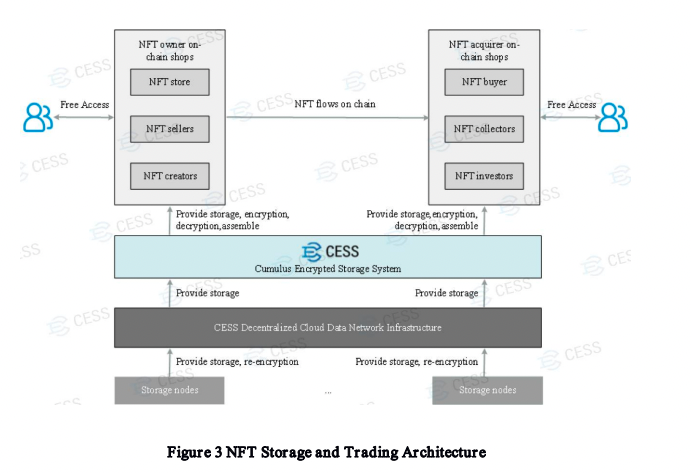
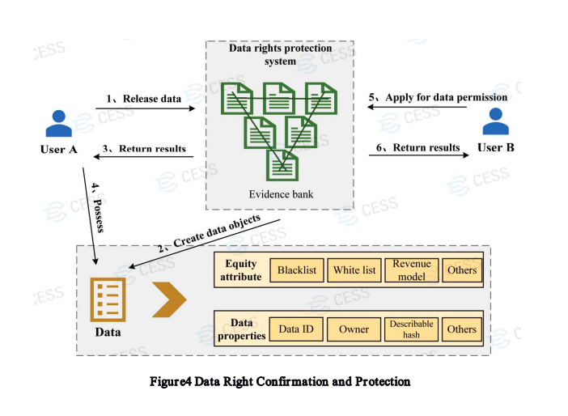

## 1. NFT 的发行与存储

NFT 通常涉及大型、高分辨率的图片，甚至是 3D 模型。**传统的集中式存储费用昂贵，具有单点故障风险，并违背了去中心化原则**，CESS 为 NFT 资产的安全存储提供了理想的解决方案。

NFT 开发者和所有者只需上传 NFT 文件，CESS 将使用多类型数据确权机制（MDRC）验证和确认所有者的数据权利，然后将数据文件分发给存储节点。数据将被正确索引和分发，从而实现了公共访问和私密安全检索 NFT。

例如，如果一位美国艺术家通过 CESS 在线向英国买家出售 NFT 艺术品，在 CESS 区块链技术的基础上，版权转让和交易时间戳将在区块链上透明执行，并保持永久可追溯。NFT 的新拥有者（即英国买家）将在在线交易完成后自动获得一个唯一的加密代码（即私钥），而美国艺术家持有的旧私钥将自动失效。

## 2. 个人网盘

CESS 为终端用户提供分布式网络驱动器，因此个人可以在其中安全地存储个人数据，如照片和文件。与传统的网络驱动器相比，CESS 在安全性、所有权保护、成本和容量方面具有显著优势。CESS 硬盘不需要云服务器，有效地避免了对集中服务器的依赖。相反，用户数据存储在多个点对点（p2p）存储节点中。

CESS 采用基于区块链的加密算法对存储的数据进行加密，确保数据隐私，无需担心数据丢失或中央服务器故障的风险。

## 3. 去中心化流媒体和社交媒体

民众对文章和视频受到大型企业和政府审查的担忧是真实存在的。通过利用 CESS 并结合区块链编写的元数据，存储此类内容可以抗审查，保护数据完整性和言论自由。

## 4. 企业级的分布式存储服务

作为一个具备庞大存储资源池的去中心化云存储系统，CESS 完美满足企业数据存储服务的需求。CESS 存储网络构建在区块链技术上，并配备多种存储验证机制，使系统提供比中心化存储提供商更快、更安全、更低成本的存储解决方案。企业还可以利用 CESS 进行数据归档和备份。

## 5. 去中心化数据交易市场

当用户将数据文件上传到 CESS 时，他们可以选择其屬性。CESS 会根据这些用户输入生成该数据文件属性。数据属性包括定价模型类型、访问控制列表等。数据属性与用户数据一起发布。每当检索数据文件时，CESS 都会检查访问者是否有权限检索该文件。如果有权限，系统将根据数据文件的定价模型向买家收费，然后开始下载数据。

在 CESS 平台上，所有数据文件的检索记录都被记录在区块链上，因此可以进行反向追溯。CESS 的数据所有权保护机制维护了一个记录模块，允许用户查看其数据文件检索记录，为用户数据权益保护提供强有力的证据。

