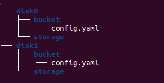

# 1. 准备 RPC 节点

您可以在自己的机器中运行自己的 RPC 节点，或者使用 CESS 官方提供的 RPC 节点。

如果您使用 CESS 官方提供的 RPC 节点，从下面列表中进行选择：

- `wss://testnet-rpc0.cess.cloud/ws/`
- `wss://testnet-rpc1.cess.cloud/ws/`
- `wss://testnet-rpc2.cess.cloud/ws/`

如果您想运行自己的 RPC 节点，有两种方法：一是通过 cess-nodeadm 程序启动，二是直接运行 cess-node 程序。下面分别介绍了这两种运行方法。

## 通过 cess-nodeadm 程序运行 RPC 节点

1. 检查 cess-nodeadm 最新的版本
   cesss-nodeadm最新版本号位置：<https://github.com/CESSProject/cess-nodeadm/tags>

   ⚠️本小节下文中所有的x.x.x用最新的版本号代替，例如最新的版本号是v0.5.3，则x.x.x用0.5.3代替。

2. 检查已安装的 cess-nodeadm 版本
   在控制台中输入 `cess version` 命令，检查 `nodeadm version` 版本是否是最新的版本。

   如果 `nodeadm version` 是最新的版本，则可以跳过第3步。如果不是最新的版本则需要走第3步进行安装。
   如果没有看到 `nodeadm version`，说明未安装过 `cess-nodeadm`，则需要走第 3 步进行安装。

3. 下载并安装cess-nodeadm程序

   ```bash
   wget https://github.com/CESSProject/cess-nodeadm/archive/vx.x.x.tar.gz
   tar -xvf vx.x.x.tar.gz
   cd cess-nodeadm-x.x.x/
   ./install.sh
   ```

4. 停止cess-node服务
   停止服务命令：cess stop chain

5. 选择脚本配置参数
   ```plain
   cess config set

   Enter cess node mode from 'authority/storage/watcher' (current: watcher,
   press enter to skip): watcher
   Enter cess node name (current: cess, press enter to skip): local-chain
   Enter cess chain pruning mode, 'archive' or number (current: null, press
   enter to skip): archive #number of blocks saved 
   ```

6. 启动本地链节点
   ```plain
   cess start chain
   ```

7. 查看链节点是否正常同步区块
   ```plain
   docker logs chain
   ```

## 直接运行 cess-node 程序

1. 安装rust环境
   [参考 Substrate 官方教程](https://docs.substrate.io/install/)

2. 获取 cess-node 最新的发布版本
   [检查 cess-node 最新的版本](https://github.com/CESSProject/cess/tags)

   以v0.7.5为最新版本为例，下载并解压cess-node程序：

   ```bash
   wget https://github.com/CESSProject/cess/archive/v0.7.5.tar.gz
   tar -zxvf v0.7.5.tar.gz
   ```

3. 编译cess-node程序
   进入cess-node目录：

   ```bash
   cd cess-0.7.5/
   cargo build --release
   ```

4. 启动RPC服务

   ```bash
   # 0.7.5版本以前含0.7.5版本输入：
   ./target/release/cess-node --base-path 【您自定义数据库存放路径】 --chain cess-testnet --port 30333 --ws-port 9944 --rpc-port 9933 --unsafe-rpc-external --unsafe-ws-external --name 【您自定义的名字】 --rpc-cors all --ws-max-connections 2020 --state-pruning archive

   #0.7.5版本以后输入：
   ./target/release/cess-node --base-path 【您自定义数据库存放路径】 --chain cess-testnet --port 30333 --rpc-port 9944 --unsafe-rpc-external --name 【您自定义的名字】 --rpc-cors all --rpc-max-connections 2020 --state-pruning archive
   ```

   若节点正在打印区块同步日志，则代表运行成功。

   ⚠️您需要保持cess-node程序一直运行，建议使用 [**screen**](https://linuxize.com/post/how-to-use-linux-screen/) 或 [**tmux**](https://linuxize.com/post/getting-started-with-tmux/) 命令为 cess-node 开启独立的窗口。

# 2. 安装 Docker 和 Docker Compose

以 Ubuntu（官方推荐存储节点操作系统）为例安装 docker.

這裡參看[官方文檔](https://docs.docker.com/engine/install/)。

1. 更新系统软件包列表

   ```bash
   sudo apt update
   ```

2. 安装必要的依赖项：

   ```bash
   sudo apt install apt-transport-https ca-certificates curl software-properties-common
   ```

3. 添加 Docker GPG 密钥：

   ```bash
   curl -fsSL https://download.docker.com/linux/ubuntu/gpg | sudo gpg --dearmor -o /usr/share/keyrings/docker-archive-keyring.gpg
   ```

4. 设置 Docker 仓库：

   ```bash
   echo "deb [arch=amd64 signed-by=/usr/share/keyrings/docker-archive-keyring.gpg] https://download.docker.com/linux/ubuntu $(lsb_release -cs) stable" | sudo tee /etc/apt/sources.list.d/docker.list > /dev/null
   ```

5. 更新软件包索引并安装Docker引擎：

   ```bash
   sudo apt update
   sudo apt install docker-ce docker-ce-cli containerd.io
   ```

6. 将当前用户添加到docker组中，这样不需要使用sudo命令来运行docker，重启后生效：

   ```bash
   sudo usermod -aG docker $USER
   ```

# 3. 配置存储节点信息

1. 为每个存储节点创建工作目录（以运行两个存储节点为例，两个存储程序的数据目录分别位于 `/mnt/disk0` 和 `/mnt/disk1`，您可以修改为自己的目录。）:

   ```bash
   cd /mnt/disk0/
   mkdir bucket storage
   cd /mnt/disk1/
   mkdir bucket storage
   ```

   其中bucket目录用于存放存储节点配置文件，storage目录作为存储节点运行的工作目录；

2. 复制以下内容，分别在每个存储节点 bucket 目录下创建 config.yaml 文件并粘贴：

   ```yaml
   # The rpc endpoint of the chain node
   Rpc:
     - "ws://127.0.0.1:9944/"
     - "wss://testnet-rpc0.cess.cloud/ws/"
     - "wss://testnet-rpc1.cess.cloud/ws/"
     - "wss://testnet-rpc2.cess.cloud/ws/"
   # Bootstrap Nodes
   Boot:
     - "_dnsaddr.boot-bucket-testnet.cess.cloud"
   # Signature account mnemonic
   Mnemonic: "xxx xxx ... xxx"
   # Staking account
   # If you fill in the staking account, the staking will be paid by the staking account,
   # otherwise the staking will be paid by the signature account.
   StakingAcc: "cXxxx...xxx"
   # earnings account
   EarningsAcc: cXxxx...xxx
   # Service workspace
   Workspace: "/opt/bucket-disk"
   # P2P communication port
   Port: 4001
   # Maximum space used, the unit is GiB
   UseSpace: 2000
   # Number of cpu's used, 0 means use all
   UseCpu: 4
   # Priority tee list address
   TeeList:
     - "127.0.0.1:8080"
     - "127.0.0.1:8081"
   ```

   需要注意，每个存储节点应设置不同的工作账户，工作路径和端口等。

   请注意，配置RPC时，第一个是本地的 RPC 节点地址，若采用第三种类型则只需要配置外部 RPC 地址；配置文件中展示的第2-第4个 RPC 地址为 CESS 官方推荐地址，Boot中展示的地址为 CESS 官方提供的存储节点 boot node 节点地址。

3. 配置好配置文件的存储节点目录应当如下图所示：

   

# 4. 配置并启动存储节点容器

请根据以下内容创建 `docker-compose.yaml` 文件，用于批量启动存储节点容器：

```yaml
version: '3'
name: cess-storage
services:
  bucket_0: #services name
    image: 'cesslab/cess-bucket:testnet'
    network_mode: host
    restart: always
    volumes: #Mapping of host disk to container
      - '/mnt/disk0/bucket:/opt/bucket' #Node configuration directory
      - '/mnt/disk0/storage/:/opt/bucket-disk' #Node working directory
    command:
      - run
      - '-c'
      - /opt/bucket/config.yaml 
    logging:
      driver: json-file
      options:
        max-size: 500m
    container_name: bucket0 #container name
  bucket_1:
    image: 'cesslab/cess-bucket:testnet'
    network_mode: host
    restart: always
    volumes:
      - '/mnt/disk1/bucket:/opt/bucket' #Node configuration directory
      - '/mnt/disk1/storage/:/opt/bucket-disk' #Node working directory,
    command:
      - run
      - '-c'
      - /opt/bucket/config.yaml
    logging:
      driver: json-file
      options:
        max-size: 500m
    container_name: bucket1
  watchtower: #only needs to be run once
    image: containrrr/watchtower
    container_name: watchtower
    network_mode: host
    restart: always
    volumes:
      - '/var/run/docker.sock:/var/run/docker.sock'
    command:
      - '--cleanup'
      - '--interval'
      - '300'
      - '--enable-lifecycle-hooks'
      - chain
      - bucket
    logging:
      driver: json-file
      options:
        max-size: 100m
        max-file: '7'
```

上述文件中，运行多少个存储节点容器就需要配置多少个存储节点服务，yaml 文件通过缩进两格来表示层级关系，如上述文件中，配置了 `bucket_0` 和 `bucket_1` 两个服务；每个服务中需要重点配置服务名，容器名以及宿主机到容器的目录映射；如在 `bucket_0` 中，目录映射配置如下：

```yaml
    volumes: #Mapping of host disk to container
      - '/mnt/disk0/bucket:/opt/bucket' #Node configuration directory
      - '/mnt/disk0/storage/:/opt/bucket-disk' #Node working directory
```

其中 `/mnt/disk0/bucket/` 是之前创建好的存放节点 0 配置文件的目录，里面有 `config.yaml`。`/mnt/disk0/storage/` 是之前创建好的存储节点 0 用于工作的工作目录；

`watchtower` 服务用于监控各存储节点容器状态，并自动为容器动态更新最新的镜像，每台服务器配置一个该服务即可；

可以将 `docker-compose.yaml` 文件放在任何可访问的地方，配置好文件后，运行 `docker compose up -d` 命令来启动存储节点容器。

您可以通过 `docker ps -a` 命令查看存储节点的运行状态。
