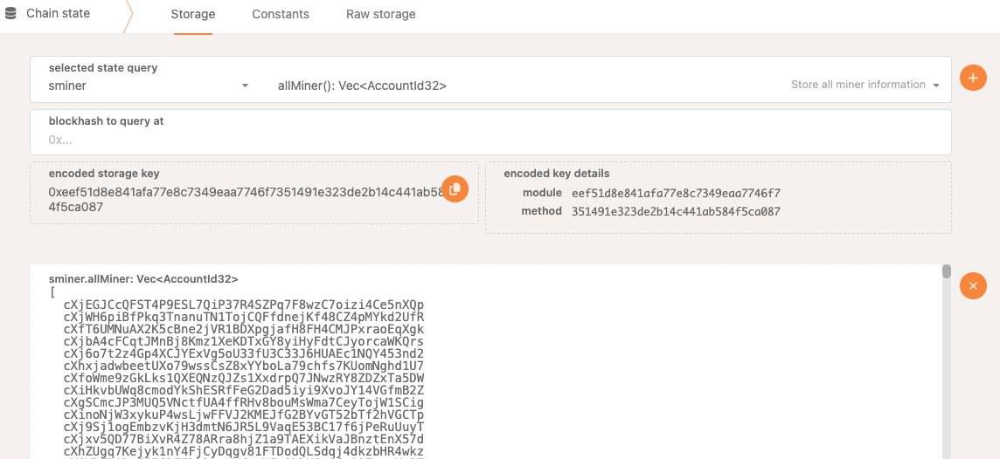

# 服务器要求

存储服务器的推荐要求：

| 资源 | 规格 |
| --- | --- |
| 推荐操作系统 | Linux 64 位英特尔/AMD |
| CPU 核心数 | ≥4 |
| 内存 | ≥8GB |
| 带宽 | ≥5Mbps |
| 公网 IP | 必需 |
| Linux 内核版本 | 5.11 或更高版本 |

# 服务器准备

## 安装 Docker

Docker 安装请参考[官方文档](https://docs.docker.com/engine/install/)。

## 防火墙配置


以下命令均以 root 权限执行。如果出现错误消息 `permission denied`，请切换到 root 权限或在这些命令的开头添加 `sudo`。


默认情况下，节点客户端 **cess-bucket**，使用端口 4001 监听传入连接，如果您的平台阻止该端口 (或在防火墙监控内) ，您需要打开对该端口的访问。

```bash
ufw allow 4001
```

## 硬盘挂载

使用以下命令检查硬盘状态`df -h`：

```bash
$ df -h
```

如果该磁盘并未挂载，则不会在存储挖矿中被使用上。使用以下命令查看硬盘是否已挂载：

```bash
$ fdisk -l

Disk /dev/vdb: 200 GiB, 214748364800 bytes, 419430400 sectors
Units: sectors of 1 * 512 = 512 bytes
Sector size (logical/physical): 512 bytes / 512 bytes
I/O size (minimum/optimal): 512 bytes / 512 bytes
Disklabel type: dos
Disk identifier: 0x331195d1
```

由上述可知，未挂载的硬盘为 `/dev/vdb`。我们将用来 `/dev/vdb` 演示，安装操作如下。

分配 `/dev/vdb` 磁盘：


```bash
fdisk /dev/vdb
Enter and press Enter:
n
p
1
2048
the value after default
w
```

将新划分的磁盘格式化为 `ext4` 格式：

```bash
mkfs.ext4 /dev/vdb
```

如果系统要求进一步输入，请输入 `y` 继续：

```bash
Proceed anyway? (y,N) y
```

创建 `/cess` 目录来挂载磁盘。这里用 `/cess` 目录作为例子：

```bash
mkdir /cess
echo "/dev/vdb /cess ext4 defaults 0 0" >> /etc/fstab
```

将 `/dev/vdb` 替换为您自己的磁盘名称。 命令中的 `/cess` 必须与上一步中创建的相同。如果您没有 root 权限，请尝试：

```bash
echo "/dev/vdb /cess ext4 defaults 0 0" | sudo tee -a /etc/fstab
```

安装 `/cess`：

```bash
mount -a
```

查看磁盘挂载状态：

```bash
df -h
```

如果 `/cess` 出现则说明磁盘挂载成功。

# 准备 CESS 账户

矿工需要创建最少两个钱包账户。

- **收益账户**：用于接收挖矿获得的奖励。
- **质押账户**：用于支付存储节点的质押费用。
- **签名账户**：用*于签名区块链交易。 如果没有指定质押账户，该账户也将用于支付质押费用。
- **存储矿工保证金**：为了确保存储节点矿工遵守其服务承诺，矿工账户将锁定其本机代币，以提供承诺的存储空间。目前在测试网上，每 TB 的存储空间需要锁定 4,000 TCESS。承诺的空间将四舍五入到最接近的 TB 单位，并锁定该数量乘以 4,000 TCESS。最小锁定代币也为 4,000 TCESS。

请参阅 [创建 CESS 帐户](../community/cess-account.md) 了解如何创建 CESS 帐户，然后前往 [CESS 水龙头](https://cess.cloud/faucet.html) 获取测试代币 TCESS，或 [联系我们](../introduction/contact.md) 获取帮助。

# 安装 CESS 客户端

1. 到這裡檢查最新的版本：<https://github.com/CESSProject/cess-nodeadm/tag>

2. 下载并安装

   ```bash
   wget https://github.com/CESSProject/cess-nodeadm/archive/vx.x.x.tar.gz
   tar -xvf vx.x.x.tar.gz
   cd cess-nodeadm-x.x.x/
   ./install.sh
   ```

   
   ⚠️ 用最新版本（截至目前为止为 **0.5.3**）替换上述的 `x.x.x`。
   

   如果最末一句出现消息 `Install cess nodeadm success`，则表示安装成功。

   如果安装失败，请查看 [故障排除步骤](./troubleshooting.md)。

# 停止并移除已有服务

停止已有的服务：

```bash
sudo cess stop
# 或者
cess down
```

移除已有的服务：

```bash
sudo cess purge
```

# 配置 CESS 客户端

## 设置网络环境

```bash
# 切换到CESS开发网：
sudo cess profile devtnet

# 或 切换到CESS测试网：
sudo cess profile testnet
```

## 準備配置文件

```bash
sudo cess config set

Enter cess node mode from 'authority/storage/watcher': storage
Enter cess storage listener port (current: 15001, press enter to skip):
Enter cess storage earnings account: # 输入账户以获得奖励，账户应以 "c..." 开头。
Enter cess storage staking signature phrase: # 请输入您的质押账户助记词
Enter cess storage disk path: # 存储硬盘路径
Enter cess storage space, by GB unit (current: 300, press enter to skip):
Enter the number of CPU cores used for mining; Your CPU cores are 4
  (current: 3, 0 means all cores are used; press enter to skip):
Enter the staker\'s payment account if you have one (press enter to skip): # 你的質押帳戶
Enter the reserved TEE worker endpoints (separate multiple values with commas, press enter to skip):
Set configurations successfully
```

- 如果提供了质押付款账户，对于测试网，承诺的空间（输入 **Enter cess storage space** 的答案）将 **四舍五入** 到最接近的 TB 单位，并将该数量乘以 4,000 个 TCESS 作为矿工押金进行锁定。
- 如果未提供质押付款账户，则会要求提供另一个账户，即签名账户，并将从该账户锁定代币。
- 如果您未提供任何 TEE 工作端点，则将使用链的默认 TEE 工作端点。这不会影响您作为存储矿工的奖励。

启动 CESS bucket

```bash
$ cess start

[+] Running 3/0
 ✔ Container chain       Running                                                0.0s
 ✔ Container bucket      Running                                                0.0s
 ✔ Container watchtower  Running                                                0.0s
```

如果您想加快存储矿工获取收益的速度，可以选择部署Marker型TEE Worker来帮助矿工认证空间和为服役文件打标，请参阅[TEE Worker用户指南](./TEE-Worker-Guide.md)

# 常用操作

## 检查 CESS 链同步状态

```bash
docker logs chain
```

如下图所示，如果我们在 [CESS 浏览器](https://testnet.cess.cloud/) 中看到 “best” 对应的区块高度约为最新高度，则说明本地链节点同步完成。


只有在链同步完成后，才能操作其他功能，如增加质押、查看节点状态等。

## 链上检查您的存储矿工状态

您可以在链上检查您的矿工状态。

1. 前往 [**Polkadot-js Apps**: Developer > Chain state](https://polkadot.js.org/apps/#/chainstate)
2. 在 *selected state query*: 中选择 **sminer** 模块和 **allMiner()** 存储项
3. 单击左侧按钮查询状态
4. 在返回的列表底部，您应该找到您的矿工地址，该地址是从您回答 `sudo cess config set` 生成的助记词（带有根路径）生成的。参见下圖示例。

   

5. 你還可以查看详细的矿工信息。選擇 **sminer** 模塊和 **minerItems(AccountId32)** 存儲項. 在 *Option\<AccountId32\>*, 中选择/输入矿工地址。它将返回您的链上详细信息。参见下圖示例。

   

6. 前往 [**Accounts** 頁面](https://polkadot.js.org/apps/#/accounts) 并检查您的账户详情，您会看到一定数量的 TCESS 被保留作为存储押金。

   


## 查看存储节点日志

```bash
docker logs bucket
```

如下图，看到 `/kldr-testnet` 表示网络环境是测试网络，看到 `Connected to the bootstrap node...` 表示有和 bootstrap 节点的连接。


## 查看存储桶状态

```bash
cess bucket stat
```

返回结果示例如下：


上述名称的进一步解释，请参阅 [术语对照](../glossary.md#storage-miner)。

At the beginning of the storage node synchronization, all your  are 0. It is only when the validated space been incremented above 0 that the storage miner start earning rewards. For testnet, it take about an hour **after** the storage node chain synchronization completed, as shown below.

在存储节点同步开始时，所有您的 **validated space** (已驗証空間), **used space** (已使用空间), 及 **locked space** (已锁定空间) 都为 0。只有当已验证空间增加到大于 0 时，存储矿工才开始赚取奖励。对于测试网，在存储节点链同步完成后大约需要一个小时，將開始驗証存儲節點空間。如下所示。


## 增加质押

```bash
sudo cess bucket increase <deposit amount>
```

## 撤回质押

当您的节点**退出 CESS 网络**（见下文）后，运行以下命令：

```bash
sudo cess bucket withdraw
```

## 查询奖励信息

```bash
sudo cess bucket reward
```

## 领取奖励

```bash
sudo cess bucket claim
```

## 更新所有服务镜像

```bash
sudo cess pullimg
```

## 停止并删除所有服务

```bash
sudo cess down
```

## 更新收入账户

```bash
sudo cess bucket update earnings [earnings account]
```

## 退出 CESS 网络

```bash
sudo cess bucket exit
```

# 升级 CESS 客户端

## 停止并删除所有服务

```bash
sudo cess stop
sudo cess down
```

## 删除所有链数据


除非 CESS 网络已重新部署且确认数据可以清除，否则请勿执行此操作。


```bash
sudo cess purge
```

## 更新 `cess-nodeadm`

```bash
wget https://github.com/CESSProject/cess-nodeadm/archive/vx.x.x.tar.gz
tar -xvf vx.x.x.tar.gz
cd cess-nodeadm-x.x.x
./install.sh --skip-dep
```

## 拉取镜像

```bash
sudo cess pullimg
```
