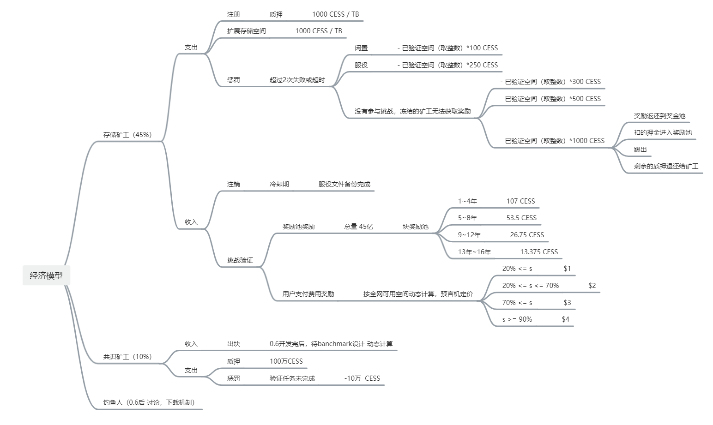

这是 CESS 的代币经济：

CESS网络总共发行 100亿代币，其中 **45% 分配给存储矿工作为奖励，10% 分配给共识矿工**。

总代币发行量每四年减半。

# 奖励

对于存储节点，只有当存储矿工完成随机审计挑战时才会授予奖励。奖励金额取决于该轮挑战的奖池以及存储矿工在整个网络中的存储能力比例。奖励发放后，存储节点必须通过发起交易来领取奖励。

奖池来源：

1. 每个时代网络产生的固定数量的硬币。前四年，平均每个区块发行 107 个 CESS 代币，并且该发行量每四年减半。
2. 当用户购买存储空间时，消耗的 CESS 代币将补充到奖池中。

存储矿工在 *第 k 轮* 的奖励根据以下因素确定：

- *TotalReward* ：*第 k 轮* CESS 网络的总奖励值。
- *ServiceSpace* ：*第 k 轮* 存储矿工被占用的空间。
- *IdleSpace* ：*第 k 轮* 存储矿机的闲置空间。
- *TotalStoragePower* ：*第 k 轮* 所有存储矿工算力的总和。

$$\boxed{StoragePower_k = IdleSpace_k * 0.3 + ServiceSpace_k * 0.7}$$

$$\boxed{RewardOrder_k = TotalReward_k * \cfrac{StoragePower_k}{TotalStoragePower_k}}$$

奖励订单是该轮存储矿工的奖励。一旦奖励确定，立即分配奖励订单的 40%，其余的在随后的六十轮中分配，每次分配剩余金额的 1/60。

*第 k 轮* 存储矿工的可用奖励计算如下：

$$\boxed{AvailableReward_k = (RewardOrder_k * 40\%) + \sum_{t=k-60}^{k-1} \cfrac{RewardOrder_t}{60}}$$

奖励订单将在全部分配完毕后删除。因此，存储矿工最多可以从 61 个订单中获得奖励。

一旦计算出矿工的奖励，它就会存储在聚合池中。矿工需要发送交易才能获取奖励。他们可以选择等待并在之后一次性领取奖励，以节省交易费用。

# 惩罚机制

如果出现以下情况，存储矿工可能会被惩罚，其质押资产将被扣除。惩罚金额取决于 Slashing 类型和存储矿工的总闲置空间和服务空间。有两种 Slashing 类型：Clearance Slashing 和 Proving Slashing。

## Proving Slashes

存储矿工将收到两次挑战。如果矿工无法通过 TEE Worker 的验证，它将受到 Proving Slashes。

Slash 算法：

$$\boxed{StorageSpace = IdleSpace + ServiceSpace}$$

$$\boxed{SlashLimit = 1000\text{ \small{CESS/TB}} * StorageSpace\text{ \small{(in TB, round up to integer)}}}$$

这意味着即使存储空间小于1TB，也将计算为1TB。如果闲置空间连续两次未能通过验证，则惩罚金额为 **Slash Limit * 10%**。如果闲置和服役空间都连续两次未能通过验证，则惩罚金额为 **Slash Limit * 25%**。

## Clearance Slashes

如果矿工无法完成存储挑战，它将被惩罚。存储挑战失败一次，扣除 **Slash Limit * 30%**；连续两次失败，**Slash Limit * 50%**；连续第三次失败，扣除 **Slash Limit * 100%**，返还剩余质押金额，并将该节点从存储节点集中删除。
